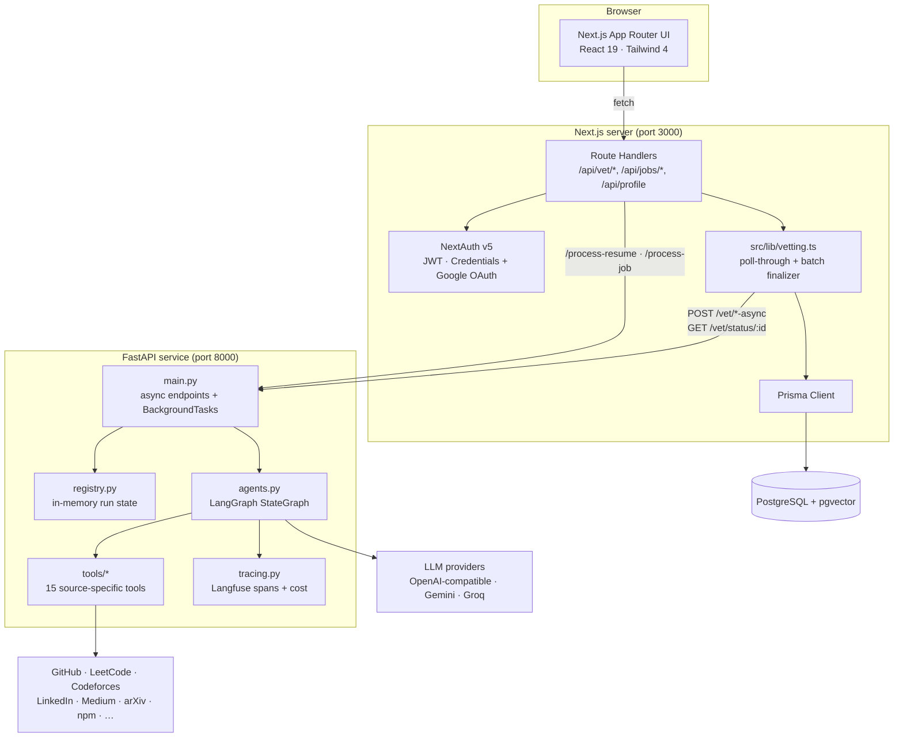
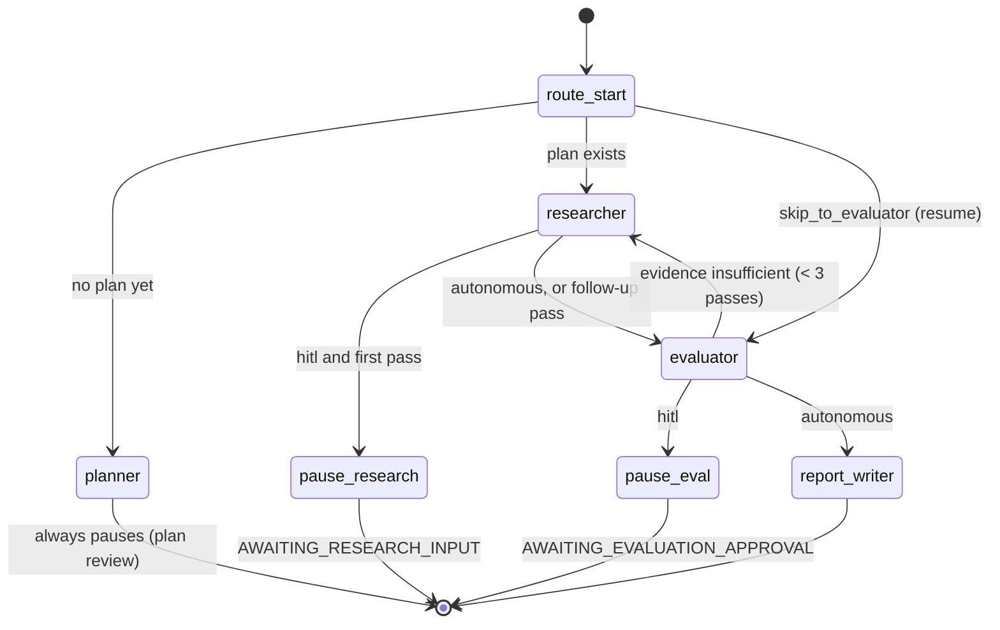
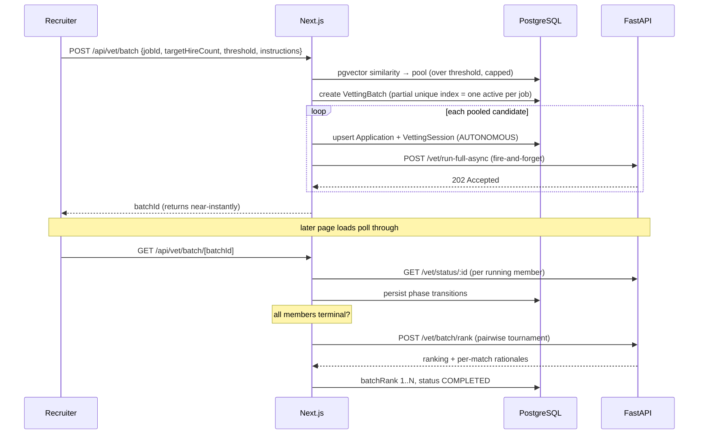
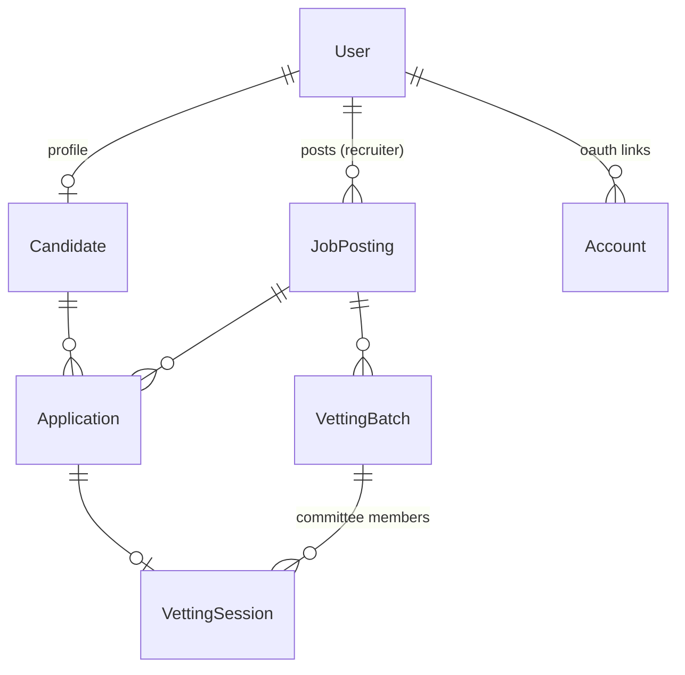
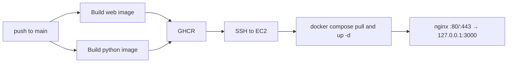

# LuminaHire

**An agentic hiring platform that researches candidates instead of keyword-matching them.**

LuminaHire replaces resume keyword screening with a supervised multi-agent pipeline. For every candidate it plans what to verify, gathers evidence from ~15 public sources (GitHub, LeetCode, Codeforces, LinkedIn, Medium, arXiv, npm, personal sites…), scores the candidate against the job description with citations, and writes a recruiter-facing hiring memo — pausing at human checkpoints so a recruiter approves each stage before the next one runs.

Production: [luminahire.tech](https://luminahire.tech) · Stack: Next.js 16 · React 19 · FastAPI · LangGraph · PostgreSQL + pgvector

---

## Table of Contents

- [Why this exists](#why-this-exists)
- [Walkthrough](#walkthrough)
- [System architecture](#system-architecture)
- [The agent pipeline](#the-agent-pipeline)
- [The tool catalog (the ReAct guardrail)](#the-tool-catalog-the-react-guardrail)
- [Human-in-the-loop state machine](#human-in-the-loop-state-machine)
- [Batch mode: the Hiring Committee](#batch-mode-the-hiring-committee)
- [Semantic matching with pgvector](#semantic-matching-with-pgvector)
- [Resilience: how a stateless HTTP UI drives a long-running pipeline](#resilience-how-a-stateless-http-ui-drives-a-long-running-pipeline)
- [Observability and cost tracking](#observability-and-cost-tracking)
- [Data model](#data-model)
- [API reference](#api-reference)
- [Tech stack](#tech-stack)
- [Local development](#local-development)
- [Environment variables](#environment-variables)
- [Deployment](#deployment)
- [Repository layout](#repository-layout)

---

## Why this exists

Conventional ATS screening reads one document the candidate wrote about themselves and matches strings against it. That optimizes for resume-writing skill, not engineering skill, and it cannot distinguish a claimed skill from a demonstrated one.

LuminaHire's premise is that for most software candidates the evidence is already public — it just isn't collected. So the system does three things a keyword filter can't:

1. **Verifies claims against primary sources.** Every score is backed by `{claim, source_url, source_type}` evidence items. A skill the candidate listed but that nothing public supports is reported as resume-only, not as verified.
2. **Keeps a human in the loop at every stage.** The recruiter edits the research plan before it runs, reviews the raw findings before they're scored, and reviews the scores before the memo is written. The agents propose; the recruiter decides.
3. **Ranks candidates against each other, not against a rubric in isolation.** Absolute LLM scores from independent runs aren't calibrated with one another, so batch mode re-ranks its shortlist through a pairwise round-robin tournament (see [Batch mode](#batch-mode-the-hiring-committee)).

---

## Walkthrough

### 1 · Stage 1 — the Planner proposes what to verify

The pipeline never starts researching on its own. The Planner reads the JD and the resume, extracts the core skills that actually need verification, and proposes an ordered research plan plus company-vetting questions. The recruiter sees it before a single external call is made.


The four-stage stepper (Planner → Researcher → Evaluator → Report) is the session's spine, and the **Session Cost** strip under it accumulates real token counts and USD across every LLM call the session has made — including HITL resumes and follow-ups.

### 2 · The plan is editable, not just viewable

Skills can be added or removed, research items reordered or deleted, and each item is tagged with the source it will be executed against (`GITHUB`, `LEETCODE`, `GFG`, `PORTFOLIO`, `LINKEDIN`, …).


Company vetting is deliberately conservative: at most one broad, checkable question per company. Most candidates aren't public figures, so asking a web search "what technologies did they use at company X" produces confident-sounding noise. Asking "does this company exist and is the claimed role plausible" produces a checkable answer.


### 3 · Stage 2 — the Researcher executes, visibly

Nothing is hidden behind a spinner. Every tool call is streamed to the UI as it happens, with its arguments and its outcome.


Findings come back as structured, attributable records. The GitHub tool, for example, doesn't just report the language list GitHub's API returns — it weights the tech stack by **bytes of code across the largest original, non-fork repos**, so a dozen tutorial repos can't outrank one real project.


### 4 · The recruiter can push the Researcher further

At the research checkpoint the recruiter can type a free-text instruction. A separate guided-research agent decides which tools that instruction implies, executes them, and appends the new findings to the session.


The chosen tool call is surfaced as a chip while it runs — the instruction "has this candidate written any technical articles" resolves to concrete tool invocations, not a vague re-prompt.


Follow-up findings are labeled as such and keep honest `NOT_FOUND` results rather than hiding them — a negative result is evidence too.


### 5 · Stage 3 — the Evaluator scores, with the evidence attached

Scoring is broken into five dimensions rather than one opaque number, and the Evaluator declares whether the evidence was sufficient. If it wasn't, it emits targeted follow-up research requests and the graph loops back to the Researcher (bounded at 3 total passes).


Verified skills are separated from gaps, and every claim carries its source link.


### 6 · Stage 4 — the completed session

Once the memo is written the session is browsable stage by stage: the plan that ran, the raw research, the evaluation, and the final report — the full audit trail behind the recommendation.


---

## System architecture

Two services, one database. The Next.js app owns auth, persistence, and the UI; the Python service owns the agents and holds no database connection at all.



**Why the split.** Embedding, PDF parsing, and the agent graph are Python-ecosystem problems (LangGraph, LangChain loaders, `pypdf`). Auth, session state, and the transactional data model are Node/Prisma problems. Keeping the Python service database-free means it is purely a compute worker: it can be restarted, scaled, or swapped without a migration, and every durable write goes through exactly one place.

**Communication is deliberately one-directional.** The Python service never calls back into Next.js. Next.js dispatches a run (`202 Accepted`, returns immediately) and then polls `GET /vet/status/{session_id}` on subsequent page loads. That removes the need for a callback URL, a shared secret, a webhook retry policy, and a queue.

---

## The agent pipeline

Four agents wired as a LangGraph `StateGraph` over a typed `AgentState`, with conditional edges for resume-aware entry, the evaluator→researcher loop, and the HITL pauses.



| Agent | Role | Structured output (Pydantic) |
|---|---|---|
| **Planner** | Reads JD + resume; decides what must be verified and where to look. | `PlannerOutputSchema` — `core_skills_to_verify`, ordered `research_plan[]`, `company_vetting` |
| **Researcher** | Pure tool executor — no judgment about the candidate, only about which tools to call. Runs the plan, or the evaluator's follow-up requests. | `research_results[]` — `{heading, source, findings, status, urls, iteration}` |
| **Evaluator** | Scores five dimensions from the gathered evidence, cites sources, decides whether it has enough to be confident. | `EvaluatorOutputSchema` — `dimension_scores`, `overall_fit_percentage`, `verified_skills`, `gaps_or_concerns`, `evidence[]`, `evidence_sufficient`, `additional_research_requests[]` |
| **Report Writer** | Turns an approved evaluation into a recruiter-facing memo. | `ReportWriterOutputSchema` — `summary`, `narrative`, `red_flags`, `interview_questions`, `hiring_recommendation`, `verdict` |

Two more LLM entry points sit outside the graph: **Q&A** (`answer_qa_question`) answers free-text recruiter questions grounded only in the session's accumulated context, and **pairwise comparison** (`run_pairwise_tournament`) powers batch re-ranking.

**Design decisions worth calling out:**

- **The Researcher makes no judgments about the candidate.** It gathers; the Evaluator judges. Keeping retrieval and assessment in separate agents with separate contexts means the thing collecting evidence has no incentive to collect evidence supporting a conclusion it already reached.
- **The evaluator→researcher loop is bounded** at `MAX_RESEARCH_ITERATIONS = 3` (one initial pass + at most two follow-ups). An agent that can always ask for more evidence will.
- **Every LLM call is schema-constrained.** Each agent returns a validated Pydantic model, so a malformed generation fails loudly at the boundary rather than propagating a half-parsed dict into the database.
- **`MOCK_AI_RESPONSES` defaults to on.** The whole pipeline runs end-to-end on deterministic fixtures with zero API keys, which makes UI work and state-machine debugging free and fast. Set `MOCK_AI_RESPONSES=0` for real runs.

---

## The tool catalog (the ReAct guardrail)

`python/tools/catalog.py` is the single source of truth for what the Researcher may do. It exists to solve a specific failure mode: given an open web-search tool, an LLM will reach for it constantly, produce plausible-sounding results about the wrong person, and burn quota doing it.

The catalog's answer is a **closed, curated tool set with exactly one deliberately generic fallback**:

| Tool | Source | Selected by |
|---|---|---|
| `get_github_data` | GitHub REST v3 — profile, repos, languages weighted by code volume | Deterministic |
| `get_github_topic_data` | Candidate's repos searched for a specific technology | LLM judgment |
| `get_linkedin_data` | Public LinkedIn profile | Deterministic |
| `get_leetcode_data` | LeetCode | Deterministic |
| `get_gfg_data` | GeeksforGeeks | Deterministic |
| `get_codeforces_data` | Codeforces | Deterministic |
| `get_hackerrank_data` | HackerRank | Deterministic |
| `get_codechef_data` | CodeChef | Deterministic |
| `get_devto_articles` | Dev.to | Deterministic |
| `get_stackoverflow_data` | Stack Overflow | Deterministic |
| `get_npm_packages` | npm registry | Deterministic |
| `get_portfolio_website_data` | Candidate's personal site | Deterministic |
| `get_medium_articles` | Medium (name-matched) | LLM judgment |
| `get_scholar_papers` | Semantic Scholar (name-matched) | LLM judgment |
| `get_arxiv_papers` | arXiv (name-matched) | LLM judgment |
| `web_search_tool` | Gemini Google-Search grounding, Tavily fallback | LLM judgment, **max 2 calls/pass** |

Three mechanisms do the actual guarding:

1. **Deterministic dispatch for unambiguous calls.** Whether a candidate has a real GitHub URL is ground truth, not a judgment call — so the Researcher calls every known-URL platform directly and only hands the LLM the genuinely ambiguous choices (`AMBIGUOUS_TOOL_DECLARATIONS`). Smaller tool-selection models otherwise reach for generic web search even when a specific link is right there.
2. **URL arguments from the model are never trusted.** `dispatch()` overrides whatever URL the model produced with the candidate's real, resume-extracted URL for that platform, and returns a skip if none exists. A hallucinated call cannot cause a fetch of a made-up profile.
3. **Hard caps.** `MAX_TOOL_CALLS_PER_PASS = 10`, at most 2 web searches per pass, bounded GitHub pagination (up to 300 repos scanned, 12 language lookups).

**Where the URLs come from.** LinkedIn and GitHub prefer the candidate's profile fields; everything else is extracted from the resume — including **real PDF link annotations**, since resumes routinely display "GitHub" as anchor text with the URL reachable only as a clickable hyperlink that plain text extraction misses entirely (`_extract_pdf_hyperlinks` in `main.py`).

---

## Human-in-the-loop state machine

Sessions run in one of two modes, recorded on the row as `pipelineMode` so that crash recovery restores the right behavior:

- **`HITL`** — single-candidate runs. Pauses after planning, after the first research pass, and after evaluation settles.
- **`AUTONOMOUS`** — batch committee members. Skips both `AWAITING_*` checkpoints and runs straight through.

```
PLANNING → RESEARCHING → AWAITING_RESEARCH_INPUT → EVALUATING → AWAITING_EVALUATION_APPROVAL → COMPLETED
                                                        ↑______________|
                                                  (evidence insufficient, < 3 passes)
```

At each checkpoint the recruiter can approve, edit, or push deeper:

| Checkpoint | Available action | Route |
|---|---|---|
| Plan | Edit skills / plan items / company questions, then approve | `POST /api/vet/session/[id]/execute` |
| Research | Free-text follow-up instruction (guided research) | `POST /api/vet/session/[id]/research/followup` |
| Research | Approve findings → start evaluation | `POST /api/vet/session/[id]/research/approve` |
| Evaluation | Request more research | `POST /api/vet/session/[id]/evaluation/request-more-research` |
| Evaluation | Approve scores → write the memo | `POST /api/vet/session/[id]/evaluation/approve` |
| Any time after completion | Ask questions grounded in the session's evidence | `POST /api/vet/session/[id]/qa` |

Note that `route_after_researcher` pauses **only on the first, plan-driven research pass**. Evaluator-triggered follow-up passes happen inside an already-approved `EVALUATING` phase, so re-pausing there would force the recruiter to approve the same stage repeatedly.

---

## Batch mode: the Hiring Committee

For "fill N seats on this role," a batch run pools every candidate above a semantic-similarity threshold (capped by `BATCH_POOL_CAP`, default 20), runs the **full autonomous pipeline for each**, and ranks the survivors.



**Why a tournament instead of sorting by score.** Each candidate's `overall_fit_percentage` comes from a fully independent Evaluator call — its own context, its own evidence, its own sampling variance. Those absolute numbers are not calibrated against one another, so sorting by them directly bakes in that noise. Instead, the top-by-absolute-score shortlist (at least `targetHireCount`, minimum 6) goes through a **round-robin pairwise tournament** where every pair is judged head-to-head with both candidates' evidence in one context, and *that* order decides the final top-N. Cost is `K × (K−1)` comparisons — fixed and bounded regardless of pool size — and every match keeps its rationale in `rankingDetails` for inspection.

**Failure behavior is explicit throughout.** If the tournament call fails (Python down, network error), finalization falls back to plain absolute-score order rather than blocking. Finalization itself is idempotent: concurrent pollers race on a status-guarded `updateMany`, and only the writer that flips `DISPATCHING/RUNNING → COMPLETED` proceeds to write ranks.

**Recruiter instructions** (free-text priorities like "weight open-source contributions heavily") are threaded into every agent prompt in the batch — planner, evaluator, report writer, and the tournament judge — and denormalized onto each session so restart/resume can rebuild the payload without a join.

---

## Semantic matching with pgvector

Resumes and job postings are embedded into the same 1536-dimensional space (Gemini embedding models with `output_dimensionality=1536`) and stored in `vector(1536)` columns via Prisma's `Unsupported` type plus the `postgresqlExtensions` preview feature.

Matching is a raw pgvector cosine-distance query joined against applications and sessions in one round trip:

```sql
CASE WHEN j.embedding IS NOT NULL AND c.embedding IS NOT NULL
     THEN (1 - (j.embedding <=> c.embedding))
     ELSE NULL END AS "matchScore"
```

**Long documents are chunked and mean-pooled.** Text over 10k characters is split with 500-character overlap, each chunk embedded, and the vectors averaged — a single embedding call would truncate a multi-page resume.

**Raw cosine similarity is calibrated before it's shown.** Measured across candidate–job pairs in this database, the model's similarities cluster in roughly 0.58–0.83 with a mean near 0.68. Displaying that directly is useless — everything looks like a 70% match. `calibrateScore()` maps `[0.60, 0.82] → [0, 100]` linearly with clamping, which spreads the actual working range across the full scale.

**Resume ingestion** (`POST /process-resume`) downloads the PDF, extracts text with LangChain's `PyPDFLoader`, falls back to **Gemini multimodal OCR** for scanned/image-only PDFs, appends real PDF hyperlink annotations, then embeds — returning text, vector, page count, and whether OCR was needed.

---

## Resilience: how a stateless HTTP UI drives a long-running pipeline

A full vetting run takes minutes. The browser can't hold a connection that long, Next.js route handlers shouldn't, and there is no queue in this deployment. The design that falls out:

**Run state lives in a threadsafe in-process registry** (`registry.py`). FastAPI `BackgroundTasks` with plain `def` functions execute in Starlette's threadpool *in the same process*, so they share module state. Entries carry a phase, partial results, a live log, accumulated usage, and a 1-hour TTL after reaching a terminal phase.

**Next.js advances the state machine by polling on read** (`pollThroughPython` in `src/lib/vetting.ts`). Any page load that touches a session whose DB status is `RESEARCHING`/`EVALUATING` asks Python for the live phase and persists whatever changed. Failure handling is explicit rather than best-effort:

| Condition | Response |
|---|---|
| Network error (Python restarting) | Leave state untouched; retry on next read |
| `404` (registry miss = Python restarted mid-run) | Mark session `FAILED` with a restart hint — state is genuinely gone |
| `COMPLETED` / `FAILED` | Persist results, then attempt batch finalization |
| `AWAITING_*` | Persist the checkpoint payload for review |
| Still running | Persist phase advance + checkpoint intermediate research |

**Intermediate research results are checkpointed on every poll.** This is what makes `POST /api/vet/session/[id]/resume` cheap: an interrupted run restarts at the evaluator instead of re-running the entire (slow, rate-limited, expensive) research stage. The resume route computes `resume_at_evaluator` from whether research was actually persisted, and passes `hitl` from the row's `pipelineMode` so a crash-recovered HITL session still pauses for review rather than silently completing.

**Concurrency is bounded at the source.** `PIPELINE_SEMAPHORE = threading.Semaphore(2)` caps concurrent full pipelines, which protects free-tier LLM rate limits during a 20-candidate batch dispatch.

**Live logs are merged, never overwritten.** LangGraph's `stream()` yields once per *node*, but agent nodes push per-tool-call lines directly into the registry mid-execution (`_emit_step`) — that's what produces the streaming activity feed in the screenshots. Every setter merges append-only, because overwriting with a node's coarser log snapshot would wipe out every live line the moment the node finished.

---

## Observability and cost tracking

Two complementary layers, both fully optional:

**Langfuse tracing.** Every pipeline invocation is a trace tagged with the DB session id as Langfuse's `session_id`, so a session's entire lifetime — initial run, HITL resumes, follow-ups, Q&A — groups under one view. Every graph node and every tool call is a nested span (`@observe`); every LLM call is a generation with model, token, and cost data. If `LANGFUSE_PUBLIC_KEY`/`LANGFUSE_SECRET_KEY` are unset, every decorator degrades to a signature-compatible no-op, so local dev and mock mode run unmodified.

**Per-session cost accounting.** Independently of Langfuse, `tracing.py` accumulates token/cost totals in a `ContextVar`, which the background runner resets before a run and reads back after. The total is merged onto `VettingSession.usage` and rendered as the **Session Cost** strip — no live round-trip to any external API. Pricing is a local per-1M-token table; an unrecognized model costs $0 rather than raising, because cost estimation must never be able to break the pipeline it is measuring.

---

## Data model

PostgreSQL via Prisma. `users` carries a `RECRUITER | CANDIDATE` discriminator; both `job_postings` and `candidates` carry a `vector(1536)` embedding.



| Model | Notable fields |
|---|---|
| `User` | `role`, `hashedPassword` (nullable — OAuth-only users), `companyName` |
| `Candidate` | `resumeUrl`, `resumeText`, `skills[]`, `linkedinUrl`, `githubUrl`, `embedding vector(1536)` |
| `JobPosting` | `description`, `requirements`, `status`, `embedding vector(1536)` |
| `Application` | `matchScore`, `aiSummary`, `aiPros[]`, `aiCons[]`, unique on `(candidateId, jobId)` |
| `VettingSession` | `status`, `pipelineMode`, and the full audit trail as JSON: `researchPlan`, `researchResults`, `evaluation`, `finalReport`, `qaHistory`, `logs`, `usage`, plus `batchId`/`batchRank` |
| `VettingBatch` | `targetHireCount`, `matchThreshold`, `recruiterInstructions`, `poolSize`/`dispatchedCount`/`skippedCount`, `topSessionIds`, `rankingDetails` |

Each pipeline stage's raw output is persisted as JSON on the session, which is what makes the completed-session stage tabs a genuine audit trail — the recruiter reads the actual artifact each agent produced, not a summary of it.

---

## API reference

### Next.js route handlers

| Method | Route | Purpose |
|---|---|---|
| `POST` | `/api/register` | Sign up as recruiter or candidate |
| `*` | `/api/auth/[...nextauth]` | NextAuth v5 handlers |
| `GET` | `/api/auth/check-provider` | Detect OAuth-only accounts before a password attempt |
| `POST` | `/api/demo-recruiter` | Idempotently provision the one-click demo recruiter |
| `GET/POST` | `/api/jobs` · `/api/jobs/[id]` | Job CRUD (embeds on write via `/process-job`) |
| `GET` | `/api/jobs/matches` | pgvector-ranked candidates for a job |
| `GET/PUT` | `/api/profile` | Candidate profile + resume ingestion |
| `POST` | `/api/vet/initiate` | Create a session and run the Planner |
| `POST` | `/api/vet/session/[id]/execute` | Approve the plan → start research |
| `POST` | `/api/vet/session/[id]/research/followup` | Free-text guided research |
| `POST` | `/api/vet/session/[id]/research/approve` | Approve findings → start evaluation |
| `POST` | `/api/vet/session/[id]/evaluation/request-more-research` | Send the evaluation back for more evidence |
| `POST` | `/api/vet/session/[id]/evaluation/approve` | Approve scores → write the report |
| `POST` | `/api/vet/session/[id]/qa` | Ask a grounded question about the session |
| `POST` | `/api/vet/session/[id]/resume` · `/restart` | Crash recovery / full re-run |
| `GET` | `/api/vet/session/[id]` · `/api/vet/sessions` | Read (polls through to Python) |
| `POST` | `/api/vet/batch` | Start a Hiring Committee run |
| `GET` | `/api/vet/batch/[batchId]` | Batch status, members, and final ranking |

### FastAPI service

| Method | Endpoint | Purpose |
|---|---|---|
| `POST` | `/process-resume` | PDF → text (+OCR fallback, +hyperlinks) → 1536-d embedding |
| `POST` | `/process-job` | Job posting → 1536-d embedding |
| `POST` | `/vet/initiate` | Planner only (synchronous) |
| `POST` | `/vet/execute-async` | Research pass in background → `AWAITING_RESEARCH_INPUT` |
| `POST` | `/vet/run-full-async` | Entire pipeline, no checkpoints (batch mode) |
| `POST` | `/vet/resume-async` | Resume from last persisted stage |
| `POST` | `/vet/research/followup` | Guided research from a free-text instruction |
| `POST` | `/vet/research/approve-async` | Evaluate → `AWAITING_EVALUATION_APPROVAL` |
| `POST` | `/vet/evaluation/approve-async` | Report Writer only → `COMPLETED` |
| `POST` | `/vet/batch/rank` | Pairwise round-robin tournament |
| `POST` | `/vet/qa` | Grounded Q&A over accumulated context |
| `GET` | `/vet/status/{session_id}` | Poll phase, partial results, logs, usage |
| `GET` | `/health` | Liveness |

All `*-async` endpoints return `202` immediately and reject a duplicate in-flight run for the same session with `409`.

---

## Tech stack

**Frontend / server** — Next.js 16 (App Router, standalone output), React 19, TypeScript 5, Tailwind CSS v4, NextAuth v5 (JWT sessions; Credentials + Google OAuth), UploadThing and Cloudinary (signed direct uploads) for resume files.

**Data** — PostgreSQL with the `vector` extension (NeonDB), Prisma 6 with a generated client and SQL migrations.

**Agents** — Python 3.11, FastAPI + Uvicorn, LangGraph `StateGraph`, LangChain community document loaders, Pydantic v2 for structured output, `pypdf`, BeautifulSoup.

**LLM providers** — a pluggable `llm_client` with one schema-constrained contract across an OpenAI-compatible endpoint, Google Gemini (native `response_schema`), Groq (JSON mode), and local Ollama for offline dev. The failover chain is preserved in-source and selected by which path `structured_generate` returns. Web search is Gemini Google-Search grounding with a Tavily fallback, because grounding is Gemini-only and needs a degradation path during a quota outage.

**Ops** — Docker multi-stage builds, Docker Compose, GitHub Actions → GHCR → EC2 over SSH, nginx reverse proxy, Let's Encrypt, Langfuse.

---

## Local development

### Prerequisites

Node.js 20+, Python 3.11+, and a PostgreSQL 15+ database with the `vector` extension (NeonDB works out of the box).

### 1 · Clone and configure

```bash
git clone https://github.com/Kanavpreet-Singh/LuminaHire.git
cd LuminaHire
```

Create a `.env` in the repository root — see [Environment variables](#environment-variables). Both services read the same file; the Python service loads it via `python-dotenv` from its parent directory.

### 2 · Next.js app

```bash
npm install
npx prisma generate
npx prisma migrate deploy     # or `migrate dev` when changing the schema
npm run dev                   # http://localhost:3000
```

The `vector` extension must exist in the database before migrating:

```sql
CREATE EXTENSION IF NOT EXISTS vector;
```

### 3 · Python agent service

```bash
cd python
python -m venv .venv
# Windows: .venv\Scripts\activate    macOS/Linux: source .venv/bin/activate
pip install -r requirements.txt
uvicorn main:app --port 8000
```

> **Run single-worker and without `--reload` during real vetting runs.** Run state lives in process memory, so a reload triggered by a file save wipes the registry mid-pipeline — Next.js will correctly detect the `404` and mark the session `FAILED`.

### 4 · Try it without any API keys

`MOCK_AI_RESPONSES` defaults to `1`, so the full pipeline runs on deterministic fixtures with no keys configured. Set `MOCK_AI_RESPONSES=0` once you've added a provider key.

Click the **light bulb** in the navbar for one-click demo-recruiter login — it provisions the demo account idempotently and signs in through the normal credentials provider.

### Docker

```bash
docker compose up --build
```

Brings up both services with `PYTHON_API_URL` already wired to the internal `python` hostname. Both ports bind to `127.0.0.1` only, since nginx terminates TLS in front of them in production.

---

## Environment variables

### Next.js

| Variable | Required | Purpose |
|---|---|---|
| `DATABASE_URL` | yes | PostgreSQL connection string (pgvector-enabled) |
| `AUTH_SECRET` | yes | NextAuth v5 JWT signing secret |
| `NEXTAUTH_URL` | production | Canonical app URL for OAuth callbacks |
| `GOOGLE_CLIENT_ID` / `GOOGLE_CLIENT_SECRET` | optional | Google OAuth sign-in |
| `PYTHON_API_URL` | yes | Agent service base URL (default `http://127.0.0.1:8000`) |
| `BATCH_POOL_CAP` | optional | Max candidates pooled per batch (default 20) |
| `UPLOADTHING_TOKEN` | optional | Resume uploads via UploadThing |
| `CLOUDINARY_CLOUD_NAME` / `_API_KEY` / `_API_SECRET` / `_UPLOAD_PRESET` | optional | Signed direct resume uploads |

### Python service

| Variable | Required | Purpose |
|---|---|---|
| `GEMINI_API_KEY` | yes | Embeddings, OCR fallback, Google-Search grounding |
| `GEMINI_EMBEDDING_MODEL` | optional | Embedding model (default `gemini-embedding-2`) |
| `EMBEDDING_DIMENSIONS` | optional | Must match the DB column (default `1536`) |
| `MOCK_AI_RESPONSES` | optional | `1` (default) runs on fixtures; `0` makes real calls |
| `OPENAI_API_KEY` / `OPENAI_BASE_URL` / `OPENAI_MODEL` | optional | OpenAI-compatible reasoning + tool selection |
| `GROQ_API_KEY` / `GROQ_MODEL` | optional | Failover provider during Gemini quota outages |
| `GITHUB_TOKEN` | recommended | Raises GitHub's rate limit from 60/hr to 5000/hr |
| `TAVILY_API_KEY` | optional | Web-search fallback when grounding is unavailable |
| `LANGFUSE_PUBLIC_KEY` / `LANGFUSE_SECRET_KEY` | optional | Tracing (no-ops entirely when unset) |
| `LLM_PROVIDER` / `OLLAMA_BASE_URL` / `OLLAMA_MODEL` | optional | Local Ollama for offline development |

Without `GITHUB_TOKEN` the unauthenticated 60 req/hr/IP limit is realistically exhausted by two or three candidates, since each profile costs a handful of calls.

---

## Deployment

Push to `main` triggers `.github/workflows/deploy.yml`:



1. Build both images and push to GHCR (`luminahire-web`, `luminahire-python`).
2. SSH to EC2, `git pull`, `docker compose pull`, `docker compose up -d --remove-orphans`.
3. nginx reverse-proxies `luminahire.tech` to `127.0.0.1:3000` with WebSocket upgrade headers and `X-Forwarded-*` (which the IP rate limiter relies on to see real client IPs); certbot manages TLS.

Required repository secrets: `EC2_HOST`, `EC2_USER`, `EC2_SSH_KEY`. `GITHUB_TOKEN` is provided automatically for GHCR.

The web image is a three-stage build (deps → `prisma generate` + `next build` → minimal runner) that ships Next.js standalone output and runs as a non-root `nextjs` user.

---

## Repository layout

```
LuminaHire/
├── src/
│   ├── app/
│   │   ├── api/
│   │   │   ├── auth/            NextAuth v5 handlers + provider detection
│   │   │   ├── jobs/            Job CRUD + pgvector matches
│   │   │   ├── profile/         Candidate profile + resume ingestion
│   │   │   ├── uploadthing/     Resume upload file router
│   │   │   └── vet/             Vetting pipeline + batch orchestration
│   │   ├── dashboard/           Recruiter dashboard, job creation
│   │   ├── jobs/                Candidate-facing job board
│   │   ├── vetting/             Session UI, stage review, batch results
│   │   ├── login/ register/     Auth pages
│   │   └── profile/             Candidate profile editor
│   ├── components/              Navbar, RecruiterDashboard, ThemeToggle, …
│   └── lib/
│       ├── auth.ts              NextAuth config, OAuth account linking
│       ├── matches.ts           pgvector query + score calibration
│       ├── vetting.ts           Poll-through, usage merge, batch finalizer
│       ├── rate-limit.ts        In-memory IP limiter for guest usage
│       └── cloudinary.ts        Signed direct uploads
├── python/
│   ├── main.py                  FastAPI app, async endpoints, pipeline runner
│   ├── agents.py                LangGraph graph + the four agent nodes
│   ├── research_agent.py        HITL guided-research agent
│   ├── registry.py              In-memory run-state registry
│   ├── llm_client.py            Structured generation + provider failover
│   ├── tracing.py               Langfuse spans + cost accounting
│   └── tools/
│       ├── catalog.py           Tool declarations, dispatch, guardrails
│       ├── github_tool.py       Profile, repos, code-volume tech stack
│       └── …                    LeetCode, GFG, Codeforces, HackerRank,
│                                CodeChef, LinkedIn, Medium, Dev.to,
│                                Stack Overflow, npm, Scholar, arXiv,
│                                portfolio, web search
├── prisma/
│   ├── schema.prisma            Models + pgvector columns
│   └── migrations/              SQL migration history
├── deploy/nginx.conf            Reverse proxy config for the EC2 host
├── .github/workflows/deploy.yml CI/CD → GHCR → EC2
├── Dockerfile                   Multi-stage Next.js standalone build
├── docker-compose.yml           Web + Python service definitions
└── public/images/               Screenshots used in this README
```

---

## License

No license file is currently present, so all rights are reserved by default. Open an issue if you'd like to use this work.
