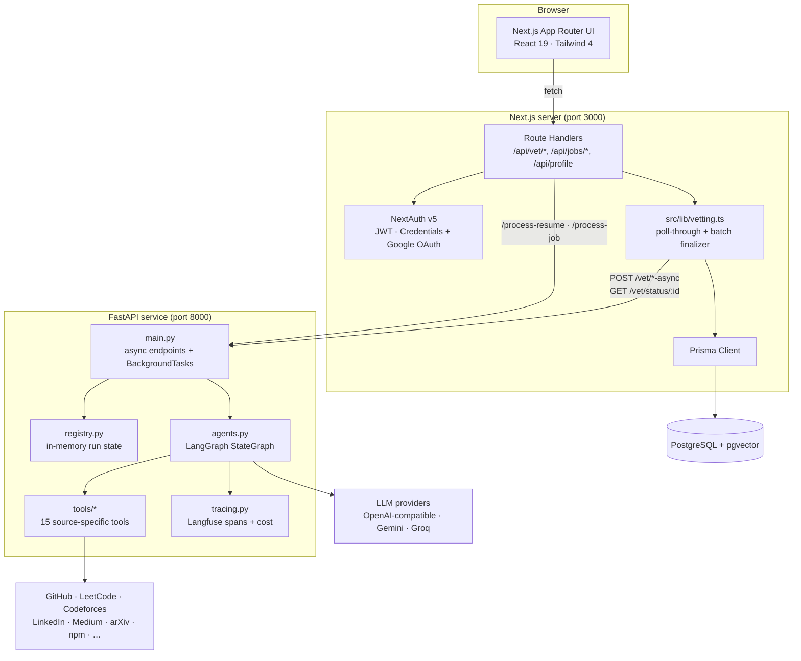
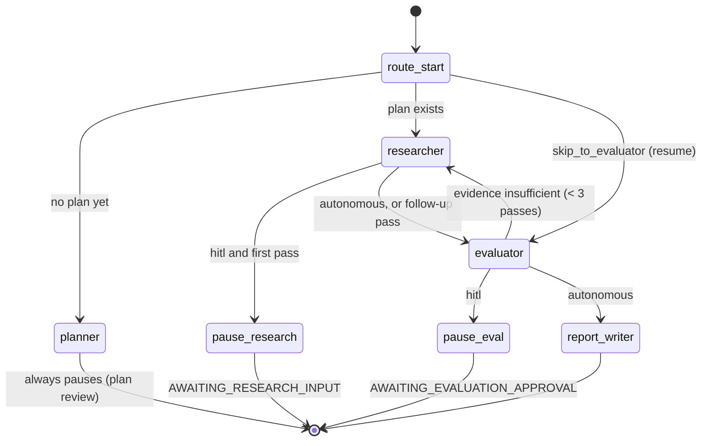
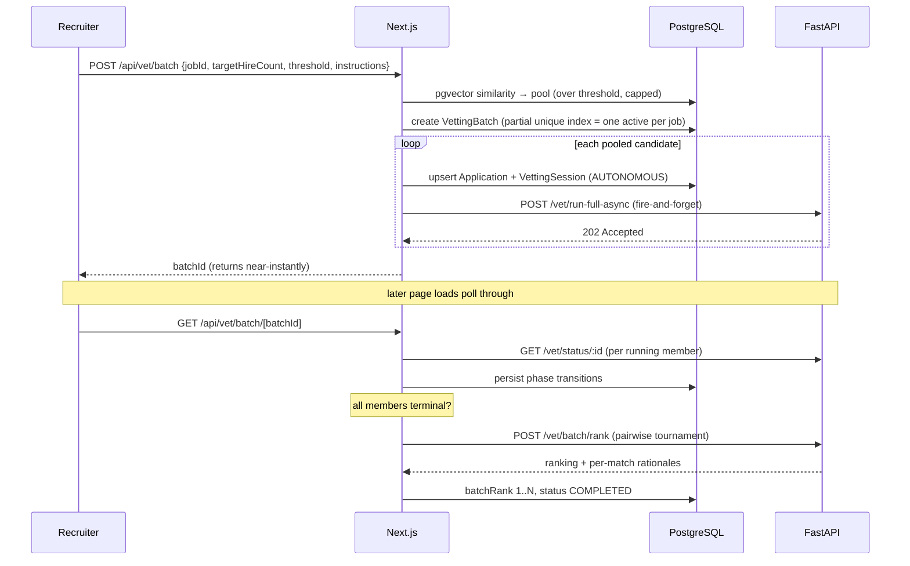
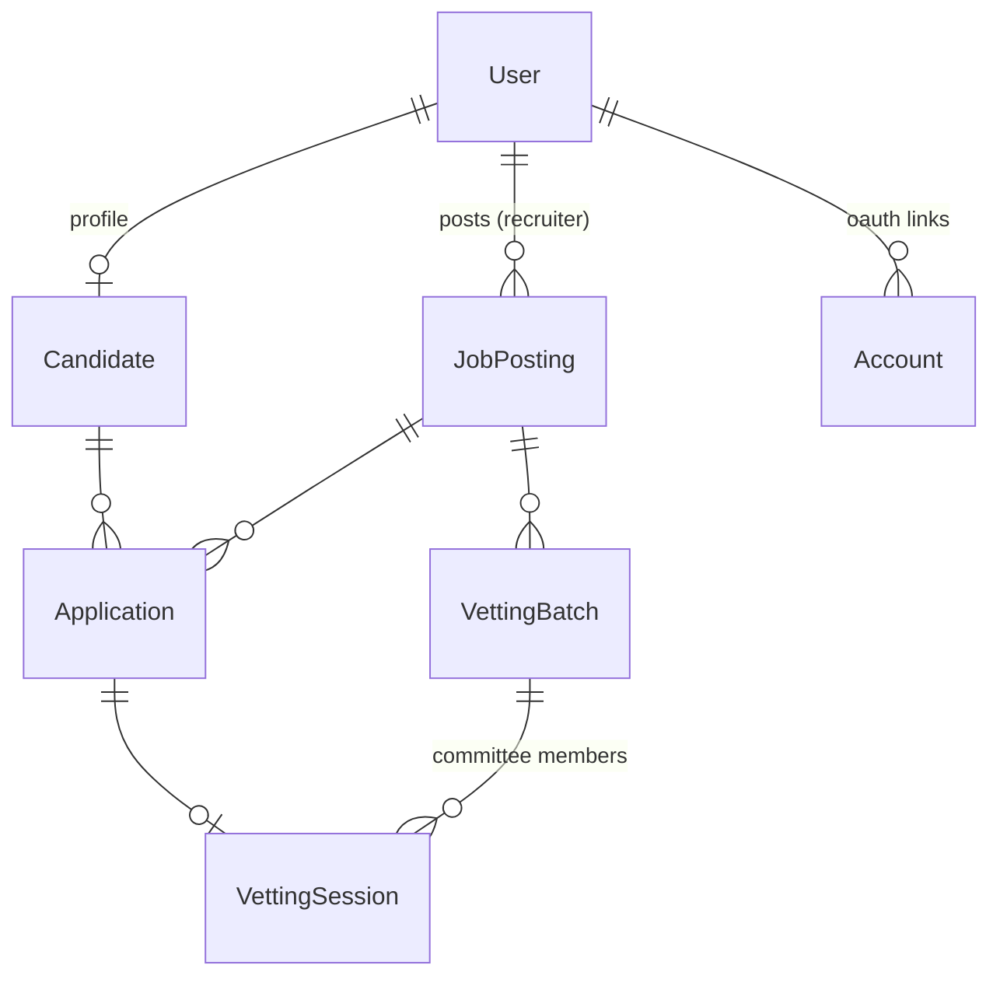
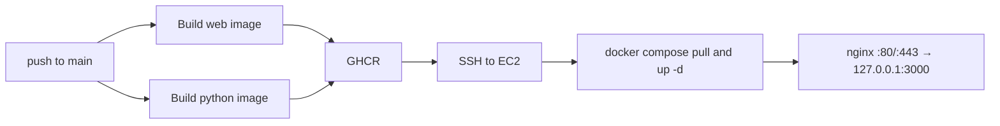

# LuminaHire

**An agentic hiring platform that verifies a résumé instead of keyword-matching it.**

LuminaHire replaces resume keyword screening with a supervised multi-agent pipeline. For every candidate it extracts the checkable claims off their résumé, tests each one against the profiles that candidate linked on that same résumé (~15 sources: GitHub, LeetCode, Codeforces, LinkedIn, Medium, arXiv, npm, personal sites…), rules every claim verified / contradicted / unverifiable, and writes a recruiter-facing hiring memo — pausing at human checkpoints so a recruiter approves each stage before the next one runs.

It is deliberately **not** an internet research tool: it never searches the open web for a candidate by name. [Why that matters](#why-this-exists).

Production: [luminahire.tech](https://luminahire.tech) · Stack: Next.js 16 · React 19 · FastAPI · LangGraph · PostgreSQL + pgvector

---

## Table of Contents

- [Why this exists](#why-this-exists)
- [Walkthrough](#walkthrough)
- [System architecture](#system-architecture)
- [The agent pipeline](#the-agent-pipeline)
- [The tool catalog (the ReAct guardrail)](#the-tool-catalog-the-react-guardrail)
- [Human-in-the-loop state machine](#human-in-the-loop-state-machine)
- [Batch mode: the Hiring Committee](#batch-mode-the-hiring-committee)
- [Semantic matching with pgvector](#semantic-matching-with-pgvector)
- [Resilience: how a stateless HTTP UI drives a long-running pipeline](#resilience-how-a-stateless-http-ui-drives-a-long-running-pipeline)
- [Observability and cost tracking](#observability-and-cost-tracking)
- [Data model](#data-model)
- [API reference](#api-reference)
- [Tech stack](#tech-stack)
- [Local development](#local-development)
- [Environment variables](#environment-variables)
- [Deployment](#deployment)
- [Repository layout](#repository-layout)

---

## Why this exists

Conventional ATS screening reads one document the candidate wrote about themselves and matches strings against it. That optimizes for resume-writing skill, not engineering skill, and it cannot distinguish a claimed skill from a demonstrated one.

LuminaHire's premise is that a résumé is a set of claims, and for most software candidates a good number of them are already checkable against links the candidate put on the résumé themselves. So the system does three things a keyword filter can't:

1. **Rules on every claim against primary sources.** Each claim comes back VERIFIED, CONTRADICTED, UNVERIFIABLE, or UNCHECKED, backed by `{claim, source_url, source_type}` evidence. A skill the candidate listed that nothing supports is reported as resume-only, not as verified.
2. **Keeps a human in the loop at every stage.** The recruiter edits the plan before it runs, reviews the raw findings before they're scored, and reviews the scores before the memo is written. The agents propose; the recruiter decides.
3. **Ranks candidates against each other, not against a rubric in isolation.** Absolute LLM scores from independent runs aren't calibrated with one another, so batch mode re-ranks its shortlist through a pairwise round-robin tournament (see [Batch mode](#batch-mode-the-hiring-committee)).

### Why it never searches the web for a candidate

An earlier version of this pipeline did search the open web per candidate. That was removed, because it fails in two ways no amount of prompt engineering fixes:

**It finds the wrong person.** Searching `"Priya Sharma" backend engineer` returns pages about many different Priya Sharmas, and nothing in the results distinguishes the candidate from a stranger with the same name. A recruiter shown someone else's GitHub or publications has been *actively misled* — strictly worse than being shown nothing, because they now have false confidence instead of a known gap.

**There is usually nothing to find.** Ordinary engineers aren't public figures, and companies don't publish per-employee breakdowns of who built what. "What did they actually own at Acme?" has no public answer, so asking burns quota and invites the model to pad thin results into something that reads like evidence.

Real recruiters don't do this either — they read the résumé and click the links on it. That's the workflow this automates, plus the part humans can't do at scale: systematically checking whether each claim matches what those links show. The rule that follows:

> **Every source LuminaHire reads was supplied by the candidate** — a profile link on their résumé, or a specific artifact it names (a paper title, a package name). Nothing is discovered by searching for the candidate's name.

Anything unreachable from a candidate-supplied source is reported `UNVERIFIABLE` and routed to the interview — never guessed at, and never held against the candidate.

**One deliberate exception:** at the research checkpoint a recruiter can type a free-text instruction that may run an open-web search. The conditions that make search dangerous don't hold there — a human asked for that specific lookup and reads the raw result — and those findings are always labelled *unconfirmed attribution* so they can't be mistaken for verified fact.

### What a ruling means

| Status | Meaning | Effect on score |
|---|---|---|
| **VERIFIED** | A candidate-supplied source directly supports the claim. | Positive — what the recruiter can bank on. |
| **CONTRADICTED** | Their own linked profile conflicts with it (résumé says 800 problems solved, profile shows 200). | Negative, surfaced as a red flag. The highest-value finding the system produces. |
| **UNVERIFIABLE** | No candidate-supplied source could settle it. Normal for internal, proprietary, or team work. | **None.** Explicitly neutral. |
| **UNCHECKED** | A relevant source existed but couldn't be read this run. | **None.** The link is surfaced to check manually. |

**Why `UNVERIFIABLE` never costs a candidate points.** Most good engineers do their best work inside private company repositories. Penalizing claims the system can't verify would systematically punish candidates for having had normal jobs and reward those who happen to work in public — a scoring bug disguised as rigor. The status describes the *public visibility of the work*, not the candidate's honesty, so those claims are scored exactly as a recruiter would score a résumé with no links at all, and each becomes an interview question instead. That conversion is the point: "we couldn't verify this" becomes *"walk me through the caching layer you built"* — a question only someone who did the work answers well.

### Identity cross-checking

Even a candidate-supplied link can point at the wrong person: résumés get copy-pasted from templates and links get typo'd. Whenever a profile publishes a real name (GitHub, LeetCode, GeeksforGeeks, Codeforces) it is matched against the résumé name *before* any of its data is trusted; a mismatch is flagged and that source is excluded from the evaluation rather than silently absorbed.

The matcher (`python/verification.py`) is lenient about the shape of a name and strict only about shared content — word order, dropped middle names, missing accents and first-name-only profiles all still match, while two names with nothing in common do not. It also skips platforms that return the handle as the display name (LeetCode's default when no real name is set), since comparing a placeholder would manufacture a false mismatch.

---

## Walkthrough

### 1 · Stage 1 — the Planner proposes what to verify

The pipeline never starts researching on its own. The Planner reads the JD and the resume, extracts the core skills that actually need verification, and proposes an ordered research plan plus company-vetting questions. The recruiter sees it before a single external call is made.


The four-stage stepper (Planner → Researcher → Evaluator → Report) is the session's spine, and the **Session Cost** strip under it accumulates real token counts and USD across every LLM call the session has made — including HITL resumes and follow-ups.

### 2 · The plan is editable, not just viewable

Skills can be added or removed, research items reordered or deleted, and each item is tagged with the source it will be executed against (`GITHUB`, `LEETCODE`, `GFG`, `PORTFOLIO`, `LINKEDIN`, …).


Employment history gets no search at all, because none is possible: companies don't publish who built what. Instead the extractor produces **reference-check questions** — for a human to ask a human, about scope and ownership — which flow through to the final memo's interview questions rather than being handed to a search engine that would return confident-sounding noise.


### 3 · Stage 2 — the Researcher executes, visibly

Nothing is hidden behind a spinner. Every tool call is streamed to the UI as it happens, with its arguments and its outcome.


Findings come back as structured, attributable records. The GitHub tool, for example, doesn't just report the language list GitHub's API returns — it weights the tech stack by **bytes of code across the largest original, non-fork repos**, so a dozen tutorial repos can't outrank one real project.


### 4 · The recruiter can push the Researcher further

At the research checkpoint the recruiter can type a free-text instruction. A separate guided-research agent decides which tools that instruction implies, executes them, and appends the new findings to the session.


The chosen tool call is surfaced as a chip while it runs — the instruction "has this candidate written any technical articles" resolves to concrete tool invocations, not a vague re-prompt.


Follow-up findings are labeled as such and keep honest `NOT_FOUND` results rather than hiding them — a negative result is evidence too.


### 5 · Stage 3 — the Evaluator scores, with the evidence attached

Scoring is broken into five dimensions rather than one opaque number, and the Evaluator declares whether the evidence was sufficient. If it wasn't, it emits targeted follow-up research requests and the graph loops back to the Researcher (bounded at 3 total passes).


Verified skills are separated from gaps, and every claim carries its source link.


### 6 · Stage 4 — the completed session

Once the memo is written the session is browsable stage by stage: the plan that ran, the raw research, the evaluation, and the final report — the full audit trail behind the recommendation.


---

## System architecture

Two services, one database. The Next.js app owns auth, persistence, and the UI; the Python service owns the agents and holds no database connection at all.


```mermaid
graph TB
    subgraph Browser
        UI[Next.js App Router UI<br/>React 19 · Tailwind 4]
    end

    subgraph NextServer["Next.js server (port 3000)"]
        API[Route Handlers<br/>/api/vet/*, /api/jobs/*, /api/profile]
        AUTH[NextAuth v5<br/>JWT · Credentials + Google OAuth]
        VET[src/lib/vetting.ts<br/>poll-through + batch finalizer]
        PRISMA[Prisma Client]
    end

    subgraph PyServer["FastAPI service (port 8000)"]
        FA[main.py<br/>async endpoints + BackgroundTasks]
        REG[registry.py<br/>in-memory run state]
        GRAPH[agents.py<br/>LangGraph StateGraph]
        TOOLS[tools/*<br/>15 source-specific tools]
        TRACE[tracing.py<br/>Langfuse spans + cost]
    end

    DB[(PostgreSQL + pgvector)]
    EXT[GitHub · LeetCode · Codeforces<br/>LinkedIn · Medium · arXiv · npm · …]
    LLM[LLM providers<br/>OpenAI-compatible · Gemini · Groq]

    UI -->|fetch| API
    API --> AUTH
    API --> VET
    VET --> PRISMA
    PRISMA --> DB
    VET -->|POST /vet/*-async<br/>GET /vet/status/:id| FA
    FA --> REG
    FA --> GRAPH
    GRAPH --> TOOLS
    GRAPH --> TRACE
    TOOLS --> EXT
    GRAPH --> LLM
    API -->|/process-resume · /process-job| FA
```

**Why the split.** Embedding, PDF parsing, and the agent graph are Python-ecosystem problems (LangGraph, LangChain loaders, `pypdf`). Auth, session state, and the transactional data model are Node/Prisma problems. Keeping the Python service database-free means it is purely a compute worker: it can be restarted, scaled, or swapped without a migration, and every durable write goes through exactly one place.

**Communication is deliberately one-directional.** The Python service never calls back into Next.js. Next.js dispatches a run (`202 Accepted`, returns immediately) and then polls `GET /vet/status/{session_id}` on subsequent page loads. That removes the need for a callback URL, a shared secret, a webhook retry policy, and a queue.

---

## The agent pipeline

Four agents wired as a LangGraph `StateGraph` over a typed `AgentState`, with conditional edges for resume-aware entry, the evaluator→researcher loop, and the HITL pauses.


```mermaid
stateDiagram-v2
    [*] --> route_start
    route_start --> planner: no plan yet
    route_start --> researcher: plan exists
    route_start --> evaluator: skip_to_evaluator (resume)

    planner --> [*]: always pauses (plan review)

    researcher --> pause_research: hitl and first pass
    researcher --> evaluator: autonomous, or follow-up pass

    evaluator --> researcher: evidence insufficient (< 3 passes)
    evaluator --> pause_eval: hitl
    evaluator --> report_writer: autonomous

    report_writer --> [*]

    pause_research --> [*]: AWAITING_RESEARCH_INPUT
    pause_eval --> [*]: AWAITING_EVALUATION_APPROVAL
```

| Agent | Role | Structured output (Pydantic) |
|---|---|---|
| **Claims Extractor** (`planner`) | Reads JD + résumé and enumerates the candidate's *checkable claims*, tagging each with which candidate-supplied source could settle it — or `NONE`, the normal answer for internal work. Prefers quantified, falsifiable claims, since that's where résumé inflation shows. | `PlannerOutputSchema` — `claims[]`, `core_skills_to_verify`, ordered `research_plan[]`, `company_vetting` (reference-check questions, not searches) |
| **Verifier** (`researcher`) | Pure tool executor — no judgment about the candidate. Fetches every linked profile deterministically, cross-checks identity on each, then makes only two judgment calls: which claimed technology to test against the candidate's own repos, and which named publication to verify. | `research_results[]` — `{heading, source, findings, status, urls, identity_check, iteration}` |
| **Claims Judge** (`evaluator`) | Rules every extracted claim against the cited evidence and scores five dimensions. | `EvaluatorOutputSchema` — `claim_verdicts[]`, `claim_summary`, `dimension_scores`, `overall_fit_percentage`, `verified_skills`, `gaps_or_concerns`, `evidence[]`, `evidence_sufficient`, `additional_research_requests[]` |
| **Report Writer** | Turns an approved evaluation into a recruiter-facing memo, with one targeted interview question per claim that couldn't be settled publicly. | `ReportWriterOutputSchema` — `summary`, `narrative`, `red_flags`, `interview_questions[]`, `hiring_recommendation`, `verdict` |

Two more LLM entry points sit outside the graph: **Q&A** (`answer_qa_question`) answers free-text recruiter questions grounded only in the session's accumulated context, and **pairwise comparison** (`run_pairwise_tournament`) powers batch re-ranking.

**Design decisions worth calling out:**

- **The Verifier makes no judgments about the candidate.** It gathers; the Claims Judge judges. Keeping retrieval and assessment in separate agents with separate contexts means the thing collecting evidence has no incentive to collect evidence supporting a conclusion it already reached.
- **The evaluator→researcher loop is bounded** at `MAX_RESEARCH_ITERATIONS = 3` (one initial pass + at most two follow-ups). An agent that can always ask for more evidence will. It also won't loop merely because claims are `UNVERIFIABLE` — re-running cannot make private work public.
- **Numeric claims are settled by arithmetic, not by the model's label.** Résumé figures are thresholds ("750+", "1000+ across two sites"), so the only question is `observed >= claimed`. The judge emits `claimed_value`/`observed_value` and Python does the comparison. This exists because the model reliably produced rationales reading *"1113 >= 1000 → VERIFIED"* attached to a status of `CONTRADICTED` — correct reasoning, wrong label, and a candidate publicly accused of inflating a figure they had actually beaten. A false `CONTRADICTED` is the most damaging output this system can produce, so it is never left to a label.
- **Missing rulings fail neutral.** Any extracted claim the judge omits is backfilled `UNVERIFIABLE`, and a crashed agent surfaces as verdict `INCOMPLETE` with the error attached — never as a silent 0% that reads like a weak candidate.
- **Every LLM call is schema-constrained.** Each agent returns a validated Pydantic model, so a malformed generation fails loudly at the boundary rather than propagating a half-parsed dict into the database. Only genuinely load-bearing fields are required: an optional annotation must never be able to discard an otherwise complete report.
- **`MOCK_AI_RESPONSES` defaults to on.** The whole pipeline runs end-to-end on deterministic fixtures with zero API keys, which makes UI work and state-machine debugging free and fast. Set `MOCK_AI_RESPONSES=0` for real runs.

---

## The tool catalog (the ReAct guardrail)

`python/tools/catalog.py` is the single source of truth for what the Verifier may do. It exists to solve a specific failure mode: given an open web-search tool, an LLM will reach for it constantly, produce plausible-sounding results about the wrong person, and burn quota doing it.

The catalog's answer is a **closed, curated tool set in which every entry reads a source the candidate supplied**. `web_search_tool` is deliberately absent from this roster — it is offered only on the HITL follow-up path (`FOLLOWUP_TOOL_DECLARATIONS`), where a human asked for that specific lookup and reads the result:

| Tool | Source | Selected by |
|---|---|---|
| `get_github_data` | GitHub REST v3 — profile, repos, languages weighted by code volume | Deterministic |
| `get_github_topic_data` | Candidate's repos searched for a specific technology | LLM judgment |
| `get_linkedin_data` | Public LinkedIn profile | Deterministic |
| `get_leetcode_data` | LeetCode | Deterministic |
| `get_gfg_data` | GeeksforGeeks | Deterministic |
| `get_codeforces_data` | Codeforces | Deterministic |
| `get_hackerrank_data` | HackerRank | Deterministic |
| `get_codechef_data` | CodeChef | Deterministic |
| `get_devto_articles` | Dev.to | Deterministic |
| `get_stackoverflow_data` | Stack Overflow | Deterministic |
| `get_npm_packages` | npm registry | Deterministic |
| `get_portfolio_website_data` | Candidate's personal site | Deterministic |
| `get_medium_articles` | Medium | LLM judgment |
| `get_scholar_papers` | Semantic Scholar — **verified by exact paper title**, confirming the candidate is among the authors | LLM judgment |
| `get_arxiv_papers` | arXiv — **verified by exact paper title** | LLM judgment |

Five mechanisms do the actual guarding:

1. **No name-based discovery.** Every tool above reads a link the candidate gave, or looks up an artifact their résumé names by title. Scholar and arXiv previously searched by *author name* and reported the first hit as the candidate's — meaning anyone sharing a name with a published academic silently inherited a stranger's publication record. They now verify a specific title and check the real author list; a bare name lookup is still possible but is reported as `ATTRIBUTION UNCONFIRMED`, never as fact.
2. **Deterministic dispatch for unambiguous calls.** Whether a candidate has a real GitHub URL is ground truth, not a judgment call — so the Verifier calls every known-URL platform directly and only hands the LLM the genuinely ambiguous choices (`AMBIGUOUS_TOOL_DECLARATIONS`: which technology to test, which publication to verify). Smaller tool-selection models otherwise reach for generic web search even when a specific link is right there.
3. **URL arguments from the model are never trusted.** `dispatch()` overrides whatever URL the model produced with the candidate's real, resume-extracted URL for that platform, and returns a skip if none exists. A hallucinated call cannot cause a fetch of a made-up profile.
4. **Identity cross-check on every named profile.** See [Why this exists](#why-this-exists) — a mistyped link is the one remaining way a candidate-supplied source can surface the wrong person's data.
5. **Hard caps.** `MAX_TOOL_CALLS_PER_PASS = 10`, bounded GitHub pagination (up to 300 repos scanned, 12 language lookups), and a bounded LLM client timeout/retry budget so a network outage fails fast instead of stalling a run for minutes.

**A failed fetch is not a finding.** These tools return the profile URL as evidence even when the fetch fails, which once meant a network outage was recorded as a successful check. Tools now set an `error` flag that the Verifier maps to status `UNREACHABLE`, and the finding text tells the Judge explicitly not to treat it as evidence either way.

**Where the URLs come from.** LinkedIn and GitHub prefer the candidate's profile fields; everything else is extracted from the resume — including **real PDF link annotations**, since resumes routinely display "GitHub" as anchor text with the URL reachable only as a clickable hyperlink that plain text extraction misses entirely (`_extract_pdf_hyperlinks` in `main.py`).

---

## Human-in-the-loop state machine

Sessions run in one of two modes, recorded on the row as `pipelineMode` so that crash recovery restores the right behavior:

- **`HITL`** — single-candidate runs. Pauses after planning, after the first research pass, and after evaluation settles.
- **`AUTONOMOUS`** — batch committee members. Skips both `AWAITING_*` checkpoints and runs straight through.

```
PLANNING → RESEARCHING → AWAITING_RESEARCH_INPUT → EVALUATING → AWAITING_EVALUATION_APPROVAL → COMPLETED
                                                        ↑______________|
                                                  (evidence insufficient, < 3 passes)
```

At each checkpoint the recruiter can approve, edit, or push deeper:

| Checkpoint | Available action | Route |
|---|---|---|
| Plan | Edit skills / plan items / company questions, then approve | `POST /api/vet/session/[id]/execute` |
| Research | Free-text follow-up instruction (guided research) | `POST /api/vet/session/[id]/research/followup` |
| Research | Approve findings → start evaluation | `POST /api/vet/session/[id]/research/approve` |
| Evaluation | Request more research | `POST /api/vet/session/[id]/evaluation/request-more-research` |
| Evaluation | Approve scores → write the memo | `POST /api/vet/session/[id]/evaluation/approve` |
| Any time after completion | Ask questions grounded in the session's evidence | `POST /api/vet/session/[id]/qa` |

Note that `route_after_researcher` pauses **only on the first, plan-driven research pass**. Evaluator-triggered follow-up passes happen inside an already-approved `EVALUATING` phase, so re-pausing there would force the recruiter to approve the same stage repeatedly.

---

## Batch mode: the Hiring Committee

For "fill N seats on this role," a batch run pools every candidate above a semantic-similarity threshold (capped by `BATCH_POOL_CAP`, default 20), runs the **full autonomous pipeline for each**, and ranks the survivors.


```mermaid
sequenceDiagram
    participant R as Recruiter
    participant N as Next.js
    participant DB as PostgreSQL
    participant P as FastAPI

    R->>N: POST /api/vet/batch {jobId, targetHireCount, threshold, instructions}
    N->>DB: pgvector similarity → pool (over threshold, capped)
    N->>DB: create VettingBatch (partial unique index = one active per job)
    loop each pooled candidate
        N->>DB: upsert Application + VettingSession (AUTONOMOUS)
        N->>P: POST /vet/run-full-async (fire-and-forget)
        P-->>N: 202 Accepted
    end
    N-->>R: batchId (returns near-instantly)

    Note over R,P: later page loads poll through
    R->>N: GET /api/vet/batch/[batchId]
    N->>P: GET /vet/status/:id (per running member)
    N->>DB: persist phase transitions
    Note over N: all members terminal?
    N->>P: POST /vet/batch/rank (pairwise tournament)
    P-->>N: ranking + per-match rationales
    N->>DB: batchRank 1..N, status COMPLETED
```

**Why a tournament instead of sorting by score.** Each candidate's `overall_fit_percentage` comes from a fully independent Evaluator call — its own context, its own evidence, its own sampling variance. Those absolute numbers are not calibrated against one another, so sorting by them directly bakes in that noise. Instead, the top-by-absolute-score shortlist (at least `targetHireCount`, minimum 6) goes through a **round-robin pairwise tournament** where every pair is judged head-to-head with both candidates' evidence in one context, and *that* order decides the final top-N. Cost is `K × (K−1)` comparisons — fixed and bounded regardless of pool size — and every match keeps its rationale in `rankingDetails` for inspection.

**Failure behavior is explicit throughout.** If the tournament call fails (Python down, network error), finalization falls back to plain absolute-score order rather than blocking. Finalization itself is idempotent: concurrent pollers race on a status-guarded `updateMany`, and only the writer that flips `DISPATCHING/RUNNING → COMPLETED` proceeds to write ranks.

**Recruiter instructions** (free-text priorities like "weight open-source contributions heavily") are threaded into every agent prompt in the batch — planner, evaluator, report writer, and the tournament judge — and denormalized onto each session so restart/resume can rebuild the payload without a join.

---

## Semantic matching with pgvector

Resumes and job postings are embedded into the same 1536-dimensional space (Gemini embedding models with `output_dimensionality=1536`) and stored in `vector(1536)` columns via Prisma's `Unsupported` type plus the `postgresqlExtensions` preview feature.

Matching is a raw pgvector cosine-distance query joined against applications and sessions in one round trip:

```sql
CASE WHEN j.embedding IS NOT NULL AND c.embedding IS NOT NULL
     THEN (1 - (j.embedding <=> c.embedding))
     ELSE NULL END AS "matchScore"
```

**Long documents are chunked and mean-pooled.** Text over 10k characters is split with 500-character overlap, each chunk embedded, and the vectors averaged — a single embedding call would truncate a multi-page resume.

**Raw cosine similarity is calibrated before it's shown.** Measured across candidate–job pairs in this database, the model's similarities cluster in roughly 0.58–0.83 with a mean near 0.68. Displaying that directly is useless — everything looks like a 70% match. `calibrateScore()` maps `[0.60, 0.82] → [0, 100]` linearly with clamping, which spreads the actual working range across the full scale.

**Resume ingestion** (`POST /process-resume`) downloads the PDF, extracts text with LangChain's `PyPDFLoader`, falls back to **Gemini multimodal OCR** for scanned/image-only PDFs, appends real PDF hyperlink annotations, then embeds — returning text, vector, page count, and whether OCR was needed.

**A résumé is mandatory.** Candidate profiles cannot be saved, matched, or vetted without an uploaded, text-extractable résumé (`src/lib/resume-required.ts`, enforced in both the API and the UI). It isn't optional metadata — it is the pipeline's input: no résumé means no claims to extract and no links to check, so a run would emit an empty report that reads like a weak candidate rather than a missing input. Replacing a résumé is allowed; removing one is not.

---

## Resilience: how a stateless HTTP UI drives a long-running pipeline

A full vetting run takes minutes. The browser can't hold a connection that long, Next.js route handlers shouldn't, and there is no queue in this deployment. The design that falls out:

**Run state lives in a threadsafe in-process registry** (`registry.py`). FastAPI `BackgroundTasks` with plain `def` functions execute in Starlette's threadpool *in the same process*, so they share module state. Entries carry a phase, partial results, a live log, accumulated usage, and a 1-hour TTL after reaching a terminal phase.

**Next.js advances the state machine by polling on read** (`pollThroughPython` in `src/lib/vetting.ts`). Any page load that touches a session whose DB status is `RESEARCHING`/`EVALUATING` asks Python for the live phase and persists whatever changed. Failure handling is explicit rather than best-effort:

| Condition | Response |
|---|---|
| Network error (Python restarting) | Leave state untouched; retry on next read |
| `404` (registry miss = Python restarted mid-run) | Mark session `FAILED` with a restart hint — state is genuinely gone |
| `COMPLETED` / `FAILED` | Persist results, then attempt batch finalization |
| `AWAITING_*` | Persist the checkpoint payload for review |
| Still running | Persist phase advance + checkpoint intermediate research |

**Intermediate research results are checkpointed on every poll.** This is what makes `POST /api/vet/session/[id]/resume` cheap: an interrupted run restarts at the evaluator instead of re-running the entire (slow, rate-limited, expensive) research stage. The resume route computes `resume_at_evaluator` from whether research was actually persisted, and passes `hitl` from the row's `pipelineMode` so a crash-recovered HITL session still pauses for review rather than silently completing.

**Concurrency is bounded at the source.** `PIPELINE_SEMAPHORE = threading.Semaphore(2)` caps concurrent full pipelines, which protects free-tier LLM rate limits during a 20-candidate batch dispatch.

**Live logs are merged, never overwritten.** LangGraph's `stream()` yields once per *node*, but agent nodes push per-tool-call lines directly into the registry mid-execution (`_emit_step`) — that's what produces the streaming activity feed in the screenshots. Every setter merges append-only, because overwriting with a node's coarser log snapshot would wipe out every live line the moment the node finished.

---

## Observability and cost tracking

Two complementary layers, both fully optional:

**Langfuse tracing.** Every pipeline invocation is a trace tagged with the DB session id as Langfuse's `session_id`, so a session's entire lifetime — initial run, HITL resumes, follow-ups, Q&A — groups under one view. Every graph node and every tool call is a nested span (`@observe`); every LLM call is a generation with model, token, and cost data. If `LANGFUSE_PUBLIC_KEY`/`LANGFUSE_SECRET_KEY` are unset, every decorator degrades to a signature-compatible no-op, so local dev and mock mode run unmodified.

**Per-session cost accounting.** Independently of Langfuse, `tracing.py` accumulates token/cost totals in a `ContextVar`, which the background runner resets before a run and reads back after. The total is merged onto `VettingSession.usage` and rendered as the **Session Cost** strip — no live round-trip to any external API. Pricing is a local per-1M-token table; an unrecognized model costs $0 rather than raising, because cost estimation must never be able to break the pipeline it is measuring.

---

## Data model

PostgreSQL via Prisma. `users` carries a `RECRUITER | CANDIDATE` discriminator; both `job_postings` and `candidates` carry a `vector(1536)` embedding.


```mermaid
erDiagram
    User ||--o| Candidate : "profile"
    User ||--o{ JobPosting : "posts (recruiter)"
    User ||--o{ Account : "oauth links"
    JobPosting ||--o{ Application : ""
    Candidate ||--o{ Application : ""
    Application ||--o| VettingSession : ""
    JobPosting ||--o{ VettingBatch : ""
    VettingBatch ||--o{ VettingSession : "committee members"
```

| Model | Notable fields |
|---|---|
| `User` | `role`, `hashedPassword` (nullable — OAuth-only users), `companyName` |
| `Candidate` | `resumeUrl`, `resumeText`, `skills[]`, `linkedinUrl`, `githubUrl`, `embedding vector(1536)` |
| `JobPosting` | `description`, `requirements`, `status`, `embedding vector(1536)` |
| `Application` | `matchScore`, `aiSummary`, `aiPros[]`, `aiCons[]`, unique on `(candidateId, jobId)` |
| `VettingSession` | `status`, `pipelineMode`, and the full audit trail as JSON: `researchPlan`, `researchResults`, `evaluation`, `finalReport`, `qaHistory`, `logs`, `usage`, plus `batchId`/`batchRank` |
| `VettingBatch` | `targetHireCount`, `matchThreshold`, `recruiterInstructions`, `poolSize`/`dispatchedCount`/`skippedCount`, `topSessionIds`, `rankingDetails` |

Each pipeline stage's raw output is persisted as JSON on the session, which is what makes the completed-session stage tabs a genuine audit trail — the recruiter reads the actual artifact each agent produced, not a summary of it.

---

## API reference

### Next.js route handlers

| Method | Route | Purpose |
|---|---|---|
| `POST` | `/api/register` | Sign up as recruiter or candidate |
| `*` | `/api/auth/[...nextauth]` | NextAuth v5 handlers |
| `GET` | `/api/auth/check-provider` | Detect OAuth-only accounts before a password attempt |
| `POST` | `/api/demo-recruiter` | Idempotently provision the one-click demo recruiter |
| `GET/POST` | `/api/jobs` · `/api/jobs/[id]` | Job CRUD (embeds on write via `/process-job`) |
| `GET` | `/api/jobs/matches` | pgvector-ranked candidates for a job |
| `GET/PUT` | `/api/profile` | Candidate profile + resume ingestion |
| `POST` | `/api/vet/initiate` | Create a session and run the Planner |
| `POST` | `/api/vet/session/[id]/execute` | Approve the plan → start research |
| `POST` | `/api/vet/session/[id]/research/followup` | Free-text guided research |
| `POST` | `/api/vet/session/[id]/research/approve` | Approve findings → start evaluation |
| `POST` | `/api/vet/session/[id]/evaluation/request-more-research` | Send the evaluation back for more evidence |
| `POST` | `/api/vet/session/[id]/evaluation/approve` | Approve scores → write the report |
| `POST` | `/api/vet/session/[id]/qa` | Ask a grounded question about the session |
| `POST` | `/api/vet/session/[id]/resume` · `/restart` | Crash recovery / full re-run |
| `GET` | `/api/vet/session/[id]` · `/api/vet/sessions` | Read (polls through to Python) |
| `POST` | `/api/vet/batch` | Start a Hiring Committee run |
| `GET` | `/api/vet/batch/[batchId]` | Batch status, members, and final ranking |

### FastAPI service

| Method | Endpoint | Purpose |
|---|---|---|
| `POST` | `/process-resume` | PDF → text (+OCR fallback, +hyperlinks) → 1536-d embedding |
| `POST` | `/process-job` | Job posting → 1536-d embedding |
| `POST` | `/vet/initiate` | Planner only (synchronous) |
| `POST` | `/vet/execute-async` | Research pass in background → `AWAITING_RESEARCH_INPUT` |
| `POST` | `/vet/run-full-async` | Entire pipeline, no checkpoints (batch mode) |
| `POST` | `/vet/resume-async` | Resume from last persisted stage |
| `POST` | `/vet/research/followup` | Guided research from a free-text instruction |
| `POST` | `/vet/research/approve-async` | Evaluate → `AWAITING_EVALUATION_APPROVAL` |
| `POST` | `/vet/evaluation/approve-async` | Report Writer only → `COMPLETED` |
| `POST` | `/vet/batch/rank` | Pairwise round-robin tournament |
| `POST` | `/vet/qa` | Grounded Q&A over accumulated context |
| `GET` | `/vet/status/{session_id}` | Poll phase, partial results, logs, usage |
| `GET` | `/health` | Liveness |

All `*-async` endpoints return `202` immediately and reject a duplicate in-flight run for the same session with `409`.

---

## Tech stack

**Frontend / server** — Next.js 16 (App Router, standalone output), React 19, TypeScript 5, Tailwind CSS v4, NextAuth v5 (JWT sessions; Credentials + Google OAuth), UploadThing and Cloudinary (signed direct uploads) for resume files.

**Data** — PostgreSQL with the `vector` extension (NeonDB), Prisma 6 with a generated client and SQL migrations.

**Agents** — Python 3.11, FastAPI + Uvicorn, LangGraph `StateGraph`, LangChain community document loaders, Pydantic v2 for structured output, `pypdf`, BeautifulSoup.

**LLM providers** — a pluggable `llm_client` with one schema-constrained contract across an OpenAI-compatible endpoint, Google Gemini (native `response_schema`), Groq (JSON mode), and local Ollama for offline dev. The failover chain is preserved in-source and selected by which path `structured_generate` returns. The OpenAI-compatible client runs with a bounded timeout and retry budget, because the SDK's generous defaults once turned a DNS failure into a 22-minute planner call with the whole run blocked behind it. Open-web search (recruiter-directed follow-ups only) uses Tavily, with Gemini Google-Search grounding preserved in-source behind it.

**Ops** — Docker multi-stage builds, Docker Compose, GitHub Actions → GHCR → EC2 over SSH, nginx reverse proxy, Let's Encrypt, Langfuse.

---

## Local development

### Prerequisites

Node.js 20+, Python 3.11+, and a PostgreSQL 15+ database with the `vector` extension (NeonDB works out of the box).

### 1 · Clone and configure

```bash
git clone https://github.com/Kanavpreet-Singh/LuminaHire.git
cd LuminaHire
```

Create a `.env` in the repository root — see [Environment variables](#environment-variables). Both services read the same file; the Python service loads it via `python-dotenv` from its parent directory.

### 2 · Next.js app

```bash
npm install
npx prisma generate
npx prisma migrate deploy     # or `migrate dev` when changing the schema
npm run dev                   # http://localhost:3000
```

The `vector` extension must exist in the database before migrating:

```sql
CREATE EXTENSION IF NOT EXISTS vector;
```

### 3 · Python agent service

```bash
cd python
python -m venv .venv
# Windows: .venv\Scripts\activate    macOS/Linux: source .venv/bin/activate
pip install -r requirements.txt
uvicorn main:app --port 8000
```

> **Run single-worker and without `--reload` during real vetting runs.** Run state lives in process memory, so a reload triggered by a file save wipes the registry mid-pipeline — Next.js will correctly detect the `404` and mark the session `FAILED`.

### 4 · Try it without any API keys

`MOCK_AI_RESPONSES` defaults to `1`, so the full pipeline runs on deterministic fixtures with no keys configured. Set `MOCK_AI_RESPONSES=0` once you've added a provider key.

Click the **light bulb** in the navbar for one-click demo-recruiter login — it provisions the demo account idempotently and signs in through the normal credentials provider.

### Docker

```bash
docker compose up --build
```

Brings up both services with `PYTHON_API_URL` already wired to the internal `python` hostname. Both ports bind to `127.0.0.1` only, since nginx terminates TLS in front of them in production.

---

## Environment variables

### Next.js

| Variable | Required | Purpose |
|---|---|---|
| `DATABASE_URL` | yes | PostgreSQL connection string (pgvector-enabled) |
| `AUTH_SECRET` | yes | NextAuth v5 JWT signing secret |
| `NEXTAUTH_URL` | production | Canonical app URL for OAuth callbacks |
| `GOOGLE_CLIENT_ID` / `GOOGLE_CLIENT_SECRET` | optional | Google OAuth sign-in |
| `PYTHON_API_URL` | yes | Agent service base URL (default `http://127.0.0.1:8000`) |
| `BATCH_POOL_CAP` | optional | Max candidates pooled per batch (default 20) |
| `UPLOADTHING_TOKEN` | optional | Resume uploads via UploadThing |
| `CLOUDINARY_CLOUD_NAME` / `_API_KEY` / `_API_SECRET` / `_UPLOAD_PRESET` | optional | Signed direct resume uploads |

### Python service

| Variable | Required | Purpose |
|---|---|---|
| `GEMINI_API_KEY` | yes | Embeddings, OCR fallback, Google-Search grounding |
| `GEMINI_EMBEDDING_MODEL` | optional | Embedding model (default `gemini-embedding-2`) |
| `EMBEDDING_DIMENSIONS` | optional | Must match the DB column (default `1536`) |
| `MOCK_AI_RESPONSES` | optional | `1` (default) runs on fixtures; `0` makes real calls |
| `OPENAI_API_KEY` / `OPENAI_BASE_URL` / `OPENAI_MODEL` | optional | OpenAI-compatible reasoning + tool selection |
| `GROQ_API_KEY` / `GROQ_MODEL` | optional | Failover provider during Gemini quota outages |
| `GITHUB_TOKEN` | recommended | Raises GitHub's rate limit from 60/hr to 5000/hr |
| `TAVILY_API_KEY` | optional | Open-web search for recruiter-directed follow-ups only; the automated pipeline never uses it |
| `OPENAI_TIMEOUT` / `OPENAI_MAX_RETRIES` | optional | Per-request ceiling and retry budget (defaults `90`s / `2`) |
| `LANGFUSE_PUBLIC_KEY` / `LANGFUSE_SECRET_KEY` | optional | Tracing (no-ops entirely when unset) |
| `LLM_PROVIDER` / `OLLAMA_BASE_URL` / `OLLAMA_MODEL` | optional | Local Ollama for offline development |

Without `GITHUB_TOKEN` the unauthenticated 60 req/hr/IP limit is realistically exhausted by two or three candidates, since each profile costs a handful of calls.

---

## Deployment

Push to `main` triggers `.github/workflows/deploy.yml`:


```mermaid
graph LR
    A[push to main] --> B[Build web image]
    A --> C[Build python image]
    B --> D[GHCR]
    C --> D
    D --> E[SSH to EC2]
    E --> F[docker compose pull and up -d]
    F --> G[nginx :80/:443 → 127.0.0.1:3000]
```

1. Build both images and push to GHCR (`luminahire-web`, `luminahire-python`).
2. SSH to EC2, `git pull`, `docker compose pull`, `docker compose up -d --remove-orphans`.
3. nginx reverse-proxies `luminahire.tech` to `127.0.0.1:3000` with WebSocket upgrade headers and `X-Forwarded-*` (which the IP rate limiter relies on to see real client IPs); certbot manages TLS.

Required repository secrets: `EC2_HOST`, `EC2_USER`, `EC2_SSH_KEY`. `GITHUB_TOKEN` is provided automatically for GHCR.

The web image is a three-stage build (deps → `prisma generate` + `next build` → minimal runner) that ships Next.js standalone output and runs as a non-root `nextjs` user.

---

## Repository layout

```
LuminaHire/
├── src/
│   ├── app/
│   │   ├── api/
│   │   │   ├── auth/            NextAuth v5 handlers + provider detection
│   │   │   ├── jobs/            Job CRUD + pgvector matches
│   │   │   ├── profile/         Candidate profile + resume ingestion
│   │   │   ├── uploadthing/     Resume upload file router
│   │   │   └── vet/             Vetting pipeline + batch orchestration
│   │   ├── dashboard/           Recruiter dashboard, job creation
│   │   ├── jobs/                Candidate-facing job board
│   │   ├── vetting/             Session UI, stage review, batch results
│   │   ├── login/ register/     Auth pages
│   │   └── profile/             Candidate profile editor
│   ├── components/              Navbar, RecruiterDashboard, ThemeToggle, …
│   └── lib/
│       ├── auth.ts              NextAuth config, OAuth account linking
│       ├── matches.ts           pgvector query + score calibration
│       ├── vetting.ts           Poll-through, usage merge, batch finalizer
│       ├── rate-limit.ts        In-memory IP limiter for guest usage
│       └── cloudinary.ts        Signed direct uploads
├── python/
│   ├── main.py                  FastAPI app, async endpoints, pipeline runner
│   ├── agents.py                LangGraph graph + the four agent nodes
│   ├── research_agent.py        HITL guided-research agent
│   ├── registry.py              In-memory run-state registry
│   ├── llm_client.py            Structured generation + provider failover
│   ├── verification.py          Identity matching + claim-status vocabulary
│   ├── tracing.py               Langfuse spans + cost accounting
│   └── tools/
│       ├── catalog.py           Tool declarations, dispatch, guardrails
│       ├── github_tool.py       Profile, repos, code-volume tech stack
│       └── …                    LeetCode, GFG, Codeforces, HackerRank,
│                                CodeChef, LinkedIn, Medium, Dev.to,
│                                Stack Overflow, npm, Scholar, arXiv,
│                                portfolio, web search
├── scripts/                     DB inspection + seed-data cleanup helpers
├── prisma/
│   ├── schema.prisma            Models + pgvector columns
│   └── migrations/              SQL migration history
├── deploy/nginx.conf            Reverse proxy config for the EC2 host
├── .github/workflows/deploy.yml CI/CD → GHCR → EC2
├── Dockerfile                   Multi-stage Next.js standalone build
├── docker-compose.yml           Web + Python service definitions
└── public/images/               Screenshots used in this README
```

---

## License

No license file is currently present, so all rights are reserved by default. Open an issue if you'd like to use this work.
