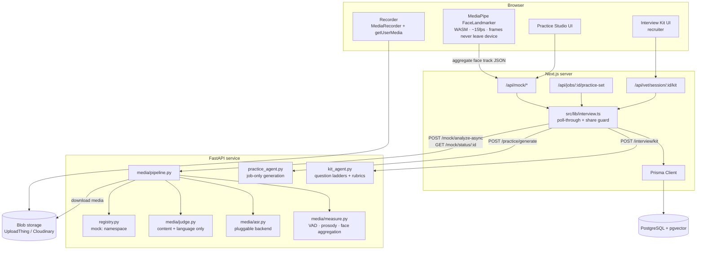
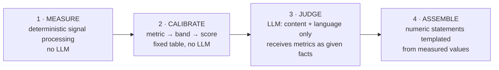

# Design — Interview Kits & Candidate Practice

**Status:** implemented, all five phases · **Scope:** two new surfaces on top of the existing vetting pipeline

> **Implementation notes.** Where the build diverged from this document, the document has been updated to match the code — this is a description of what exists, not a proposal. Three things worth flagging up front:
>
> - **Heavy media dependencies are opt-in at build time** (`--build-arg WITH_MEDIA=1`, `python/requirements-media.txt`). Without them the service boots, mock mode runs, and every test passes; `GET /mock/capabilities` reports what is missing and the UI offers typed answers instead of letting someone record into a pipeline that cannot transcribe. Absent metrics are dropped from the score, never counted as zero.
> - **Text mode judges synchronously**, since it is one fast LLM call. Only the media path is async with a registry namespace.
> - **The database is managed with `prisma db push`**, not the migrate engine — it has no `_prisma_migrations` table. The migration SQL in `prisma/migrations/20260726120000_add_interview_kits_and_practice/` is kept as documentation and carries a header explaining why `migrate deploy` must not be run against it without baselining first.

This document designs two features that share one spine:

1. **Interview Kit** (recruiter-facing) — turn a completed vetting session into a runnable interview: laddered questions bound to specific claims, per-question rubrics, a time-boxed agenda, and in-interview note capture that writes back to the session.
2. **Practice Studio** (candidate-facing) — per-job practice questions the candidate answers by recording video, scored on what they said *and* how they delivered it, with specific coaching on how to do it better.

Neither is a bolt-on. The Kit is the natural terminus of the product's existing thesis — *"we couldn't verify this" becomes "walk me through the caching layer you built"* — which the current `report_writer_node` only half-delivers. The Practice Studio is the first candidate-facing surface in a product that has so far only served recruiters.

---

## Table of Contents

- [The invariant that shapes everything](#the-invariant-that-shapes-everything)
- [System architecture](#system-architecture)
- [Feature A — the Interview Kit](#feature-a--the-interview-kit)
- [Feature B — Practice Sets](#feature-b--practice-sets)
- [Feature C — the mock attempt](#feature-c--the-mock-attempt)
- [The analysis pipeline](#the-analysis-pipeline)
- [What gets measured](#what-gets-measured)
- [From metrics to scores](#from-metrics-to-scores)
- [The coaching output](#the-coaching-output)
- [Data model](#data-model)
- [API surface](#api-surface)
- [Async execution and failure model](#async-execution-and-failure-model)
- [Cost and performance budget](#cost-and-performance-budget)
- [Fairness, privacy, and what we deliberately do not do](#fairness-privacy-and-what-we-deliberately-do-not-do)
- [Mock mode and testability](#mock-mode-and-testability)
- [Build phases](#build-phases)
- [Open questions](#open-questions)

---

## The invariant that shapes everything

Two populations now use the same database, and one of them is being evaluated by the other. That creates a leak surface the current architecture has never had to think about.

> **Practice questions are generated from the job posting and the candidate's own résumé. They are never generated from, derived from, or informed by any `VettingSession` — not its claims, not its verdicts, not its Interview Kit.**

Three concrete failures this prevents:

**A candidate learns which of their claims was `CONTRADICTED`.** If practice questions were personalized off their vetting session, a candidate would discover the system caught their résumé inflation — and then rehearse a cover story for exactly that gap. The product would be coaching people through its own detection. The contradiction belongs in the interview, in front of a human, unrehearsed.

**A candidate reads the recruiter's interview questions before the interview.** The Kit's value is that it probes what can't be faked. Leaking it converts every question into a take-home.

**A candidate infers they are being vetted.** Session existence is itself information. Practice sets are per-*job* and published to everyone who can see the job, so requesting one reveals nothing.

**Enforcement is structural, not prompt-level.** Prompt instructions are not a security boundary:

| Layer | Mechanism |
|---|---|
| Schema | `PracticeSet` has no foreign key to `VettingSession` or `Application`. The join does not exist. |
| Python | `generate_practice_set(job, resume)` — the function takes no session argument and the endpoint's Pydantic model has no session field. A leak would require a signature change, which is reviewable. |
| Next.js | Candidate routes resolve the practice set by `jobId` only, under a candidate-role guard. Kit routes are recruiter-role and scoped to session ownership. |
| Cache key | Practice sets are cached per `(jobId, version)`. There is no per-candidate generation path that could accidentally receive session context. |

The one permitted personalization is **retrieval, not generation**: the published set is re-ordered per candidate using their own résumé embedding against each question's competency. That reads only data the candidate supplied about themselves.

---

## System architecture

Both features live inside the existing two-service split. The Python service gains a media path; Next.js gains two route trees and keeps sole ownership of persistence.



**The Python service still holds no database connection.** Media is fetched from its blob URL, analyzed, and the result handed back through the same poll-through channel that already carries vetting results. No new communication direction, no callbacks, no queue — the property that makes the existing deployment simple is preserved exactly.

**Face analysis runs in the browser, on purpose.** MediaPipe's `FaceLandmarker` produces 52 ARKit blendshape coefficients plus a 4×4 head transform per frame, in WASM, at 15fps on a mid-range laptop without touching a GPU. The video frames never leave the device for facial analysis; only a compact numeric track does. That is simultaneously the cheapest option (no GPU on the EC2 box), the most private, and the one that lets the recorder show live framing feedback *while recording* rather than after.

The honest cost: a client-computed signal is spoofable. A determined candidate could forge a face track showing perfect eye contact. This is a practice tool whose output is private to that same candidate — forging it means lying to yourself — so the incentive is absent. **It follows that the presence signals are not proctoring-grade and must never be repurposed as one.** If a proctored assessment is ever built, the face track is not the input to use.

---

## Feature A — the Interview Kit

### What exists today, and why it isn't enough

`report_writer_node` already emits `interview_questions_detailed`: `{question, targets_claim_id, why}`. That is a list of questions. What a recruiter needs 20 minutes before a call is an *interview*.

The gap:

| Missing | Why it matters |
|---|---|
| **Follow-up ladders** | A single question is answerable from a well-rehearsed résumé story. The signal is in the third follow-up, where the person who did the work has details and the person who didn't runs out. |
| **A rubric per question** | Without one, "did they answer well?" is the interviewer's gut — the same unstructured judgment the whole pipeline exists to replace. |
| **Time-boxed ordering** | 14 undifferentiated questions for a 45-minute slot means the interviewer improvises which to drop, usually dropping the hard ones. |
| **Outcome capture** | Nothing records what the candidate actually said. The verification pipeline never learns whether its rulings were right. |

### Sourcing priority

The Kit allocates interview minutes by information value, not by claim order:

| Claim status | Kit treatment | Rationale |
|---|---|---|
| `CONTRADICTED` | **Highest priority.** A non-accusatory question that gives the candidate room to explain, plus a follow-up that resolves it either way. | The most consequential thing on the report. It must be resolved by a human, and a résumé figure can be stale or misread. |
| `UNVERIFIABLE` **and** JD-critical | Core probes, laddered. | The stated reason the product tolerates unverifiable claims — this is where they get settled. |
| `UNVERIFIABLE` **and** peripheral | Dropped. | Interview time is the scarcest resource in the whole system. |
| `VERIFIED` | **Never re-asked.** May seed one *depth* question that goes past what the artifact shows. | Re-litigating something already evidenced wastes the slot and signals to the candidate that the evidence wasn't read. |
| JD requirement with no claim at all | One gap question. | The résumé is silent; the interview is the only channel. |
| `company_vetting` items | Routed to a separate **reference-check** section, not the interview. | These are questions for a former manager, not the candidate. The planner already produces them for exactly this purpose. |

### The ladder

Each core question is a sequence that gets progressively harder to answer from a memorized narrative:

```
L1  Scope        "Walk me through the caching layer you built at Acme."
L2  Failure      "What broke when you first shipped it?"
L3  Tradeoff     "Why write-through rather than write-back?"
L4  Quantity     "What was the hit rate before and after?"
```

L4 exists because a specific number is the cheapest lie to tell and the most expensive one to sustain — the follow-up to a fabricated number is arithmetic. The interviewer is instructed to stop laddering as soon as L1–L2 are answered with unprompted specificity; the ladder is a depth budget, not a script to read.

### Rubric shape

```json
{
  "strong":       ["names a concrete invalidation strategy", "cites a measured before/after", "volunteers a tradeoff unprompted"],
  "weak":         ["describes caching generically", "credits 'the team' without stating own scope"],
  "disqualifying":["cannot name the technology they listed on the résumé"],
  "note":         "Vagueness is not disqualifying on its own — NDAs are real. Probe for shape, not for proprietary detail."
}
```

That last field is deliberate. A rubric that reads reticence as evasion penalizes candidates with genuine confidentiality obligations, reproducing at interview time exactly the bias the `UNVERIFIABLE`-is-neutral rule removed at scoring time.

### Closing the loop

Each `InterviewKitQuestion` carries `askedAt`, `interviewerRating` (1–5), and `interviewerNotes`, written live from the Kit UI. This is the highest-value byproduct in the design: it produces `(claim, automated verdict, human outcome)` triples. Those are the only data that can ever answer *"is the verification actually right?"* — precision on `CONTRADICTED` rulings, and whether `UNVERIFIABLE` claims tend to hold up. The existing `python/eval/rank_eval.py` is the natural home for that analysis.

### Where it runs

**Outside the LangGraph graph**, alongside `answer_qa_question` and `run_pairwise_tournament`. The Kit is a derived artifact of a *completed* evaluation, not a pipeline stage: it is generated on demand, regenerable with recruiter instructions ("focus on system design", "this is a 30-minute screen"), and its failure must never be able to fail a vetting run. One schema-constrained LLM call over the session's `claim_verdicts` + `evaluation` + JD.

---

## Feature B — Practice Sets

### Generated per job, not per candidate

A practice set is generated **once per job posting, versioned, and cached**. Cost is `O(jobs)`, not `O(candidates × jobs)` — the difference between one call and one per applicant per attempt.

Personalization then happens by retrieval:

1. Embed each question's `competency` string (the pgvector infrastructure already exists).
2. Rank against the candidate's own résumé embedding.
3. Order so the candidate's weakest JD-relevant competencies come first, since that's where practice pays.

Zero marginal LLM cost per candidate, and structurally incapable of leaking session data.

**One exception:** a single `PERSONAL` question — *"Walk me through <the most substantial project on their résumé>."* — is generated per candidate from their own résumé text only, then cached on the candidate row and reused across every job. One small call per candidate, ever.

### Composition

A default set is 8 questions across categories, each tagged with a JD competency and a `targetSeconds` that drives the pacing score:

| Category | Count | Target | Purpose |
|---|---|---|---|
| `ROLE_MOTIVATION` | 1 | 60s | Warmup. Nearly everyone has an answer, which settles nerves and gives a clean baseline for their normal speaking rate. |
| `PROJECT_WALKTHROUGH` | 2 | 180s | Where the interview is usually won or lost. Long enough that structure becomes visible. |
| `BEHAVIORAL` | 2 | 120s | STAR-shaped. The category where structural coaching helps most. |
| `TECHNICAL_CONCEPT` | 2 | 90s | Verbal explanation of something in the JD stack — a different skill from writing it. |
| `SYSTEM_DESIGN` | 1 | 180s | Only for roles whose JD warrants it; omitted otherwise. |

Each question stores its own rubric at authoring time (`must_cover`, `strong_signals`, `common_mistakes`). This matters more than it looks: it means the judge at scoring time is comparing an answer against a fixed, inspectable standard rather than improvising one per submission. Same reason the vetting evaluator scores against extracted claims rather than free-associating.

### Publishing

Sets are `DRAFT → PUBLISHED → ARCHIVED`, versioned per job. A recruiter may review and edit before publishing; an unpublished job auto-generates a set lazily on the first candidate request so the feature works with zero recruiter effort. Editing a published set creates version N+1 rather than mutating it — existing `MockAnswer` rows keep pointing at the question they were actually asked, so a historical attempt never becomes unreadable.

---

## Feature C — the mock attempt

### The recording flow

```
Preflight  →  Question  →  Prep  →  Record  →  Review  →  Upload  →  (background analysis)
              (shown)      (30s)    (target±)   (retake?)
```

**Preflight is not optional.** Camera permission, mic permission, a live level meter, a face-detected indicator, and a lighting check — before question one. The dominant failure mode in every video-interview product is discovering after a 3-minute take that the mic was on the wrong device. Preflight costs 15 seconds and eliminates it.

**Upload precedes analysis, always.** The recording is durably stored the moment it stops. Analysis is a separate, retryable step. A candidate must never lose a take because a background job died.

**Retakes are first-class.** `MockAnswer` carries `attemptNo` and `isFinal`; only the final attempt is scored and counted. Rehearsal *is* the product — a tool that punishes a second take is not a practice tool. (Cost control: only `isFinal` attempts are analyzed, so retakes are free until the candidate commits.)

**Live feedback during recording**, from the same MediaPipe stream that produces the face track: a framing guide, an off-camera nudge, and a pace indicator once ASR-free heuristics allow. Feedback in the moment is worth more than a report afterward, and it costs nothing extra — the computation is already running.

### The face track

The browser emits one row per sampled frame at ~15 Hz:

```json
{"t":12.40,"present":true,"yaw":-3.1,"pitch":1.8,"roll":0.4,
 "bbox":[0.41,0.22,0.19,0.26],
 "bs":{"smile":0.12,"browDown":0.03,"browInnerUp":0.08,"blink":0.91,"jawOpen":0.22,
       "gazeOutL":0.10,"gazeOutR":0.09,"gazeUp":0.02,"gazeDown":0.31}}
```

~10 numbers × 15 fps × 180 s ≈ 27k values, roughly 40 KB gzipped. Posted as a JSON body alongside the media URL — no separate blob, no separate lifecycle.

**The raw track is not persisted.** The server aggregates it into the metrics block and a 1 Hz downsampled timeline for the UI chart, then discards it. Storing per-frame facial geometry indefinitely creates a biometric dataset with real obligations attached and no product use that the aggregate doesn't already serve. Cap the accepted payload at 2 MB and reject beyond it.

---

## The analysis pipeline

The pipeline's organizing principle is inherited directly from the vetting side:

> **Numeric claims are settled by arithmetic, not by the model's label.**

The existing code adopted that rule after the evaluator produced the rationale *"1113 >= 1000 → VERIFIED"* attached to a status of `CONTRADICTED`. The same failure mode is guaranteed here and worse: ask a model "how many times did they pause?" and it will answer with a confident integer it did not count. A candidate told they paused 14 times when they paused 4 has been given false, unfalsifiable, discouraging feedback.

So the pipeline is three layers with a hard boundary between measurement and judgment:



**Layer 3 never produces a number about delivery.** It receives them. Its job is content quality, language quality, and prose — the things it is actually good at.

**Layer 4 templates every numeric statement.** *"You averaged 178 words per minute"* is string interpolation over a measured value, not generated text. The model may say *"you're speaking fast enough that your strongest point gets lost"*; it may not say *"about 180 words a minute"*.

### Stages for one answer

| # | Stage | Implementation | LLM? |
|---|---|---|---|
| 1 | Fetch | Download media from blob URL to temp | — |
| 2 | Demux | `ffmpeg -i in.webm -vn -ac 1 -ar 16000 out.wav` | — |
| 3 | Voice activity | Silero VAD → speech/silence timeline | — |
| 4 | Transcribe | Pluggable ASR with word timestamps | optional |
| 5 | Prosody | librosa: F0 track, RMS energy | — |
| 6 | Aggregate face | Face track → presence/gaze/expression/stability | — |
| 7 | Calibrate | Metric bands → delivery + presence sub-scores | — |
| 8 | Judge | Transcript + rubric + measured facts → content, language, coaching | **yes** |
| 9 | Persist | Metrics + analysis onto `MockAnswer` | — |

Stages 1–7 and 9 cost nothing but CPU. Exactly one LLM call per answer, plus one per session at finalize.

### The ASR boundary

Word transcription is the only pluggable component, via `ASR_BACKEND=faster_whisper|gemini`:

- `faster_whisper` — `small.en`, int8, CPU. Local, private, free, ~0.4× realtime.
- `gemini` — for deployments without CPU headroom. Audio only; the video never goes to a third party.

**Pause and rhythm metrics never depend on this choice.** They come from VAD (stage 3), which is local, deterministic, and runs regardless of backend. Swapping ASR changes transcript quality; it cannot change the pause count. That separation is what makes the delivery scores reproducible across deployments.

**A known ASR gotcha, stated up front:** Whisper-family models *normalize away disfluencies*. Ask for a transcript and "um, so I, I basically built" comes back as "So I built." Filler-word counting on a raw Whisper transcript silently reports ~0 fillers for everyone. Mitigations, in order:

1. Decode with `condition_on_previous_text=False` and no text normalization, which preserves substantially more disfluency.
2. **Acoustic cross-check** — VAD-detected voiced segments with no aligned word are filler or false starts by construction. This is backend-independent and catches what the decoder drops.
3. Validate against hand-labeled clips before shipping the filler metric. If measured recall is poor, **ship the feature without a filler count rather than with a wrong one.** A confidently wrong "3 fillers" is worse than an absent metric.

---

## What gets measured

### Speech and rhythm (from VAD + word timestamps)

| Metric | Definition | Coaching value |
|---|---|---|
| `speech_rate_wpm` | words ÷ total duration | Overall pace including pauses |
| `articulation_rate_wpm` | words ÷ voiced time | Pace while actually talking — separates "fast talker" from "many pauses" |
| `pause_count_long` | inter-word gaps > 1.0 s | Hesitation |
| `pause_count_stall` | gaps > 2.5 s | Lost-the-thread moments; the highest-signal delivery metric |
| `pause_ratio` | silence ÷ total | Density |
| `longest_stall_s` / `longest_run_s` | extremes | The specific moment to review; unbroken monologue length |
| `time_to_first_word_s` | record start → first word | Composure under a cold open |
| `filler_rate` | fillers ÷ words | Verbal tics — *conditional on validation above* |
| `restart_rate` | self-corrections per 100 words | False starts, detected via repeated n-grams within a short window |
| `answer_duration_s` vs `targetSeconds` | ratio | Whether they can hold a time box |

### Prosody (from the audio signal)

| Metric | Definition | Note |
|---|---|---|
| `f0_median_hz`, `f0_iqr_hz` | pitch center and spread | **Only IQR is scored.** Median pitch is a property of the speaker's body, not their performance — scoring it would penalize voices for existing. |
| `pitch_monotony` | normalized inverse of F0 IQR | The one prosody signal with clear coaching value |
| `energy_cv` | RMS coefficient of variation | Emphasis and dynamic range |
| `terminal_decay` | mean energy slope over final 15% of each utterance | Trailing off — extremely common and extremely fixable |

**All prosody is within-clip relative.** Consumer mic gain varies by an order of magnitude, so absolute dB is meaningless and absolutely non-comparable across people. Anything cross-clip is a bug.

### Presence (from the aggregated face track)

| Metric | Definition |
|---|---|
| `face_present_ratio` | fraction of frames with a detected face |
| `camera_facing_ratio` | fraction with head yaw/pitch within a cone toward the lens |
| `longest_look_away_s` | longest continuous off-camera stretch |
| `head_stability` | inverse variance of yaw/pitch/roll — distinguishes engaged movement from sway |
| `framing_score` | face bbox center offset + size fraction → too close / too far / off-center |
| `expression_variability` | variance of smile + brow blendshapes over time |
| `positive_expression_ratio` | fraction of frames with smile coefficient above threshold |
| `blink_rate_per_min` | from blink blendshape peaks |

**These are named as observations, not inferences.** `camera_facing_ratio` is head orientation toward the lens — a proxy for eye contact, not a measurement of it, since true gaze needs per-user calibration. The UI says *"you were facing away from the camera for 22 seconds"*, never *"you seemed disengaged"*. See [Fairness](#fairness-privacy-and-what-we-deliberately-do-not-do) for why that distinction is load-bearing rather than pedantic.

`blink_rate_per_min` is measured because it is nearly free, and reported only as a raw observation. It is **not scored**: the stress correlation in the literature is weak, and contact lenses, dry air, and screen distance move it more than nerves do.

---

## From metrics to scores

### Calibration bands

Raw metrics are mapped to 0–100 through a **fixed, inspectable, piecewise-linear table** — the same move `calibrateScore()` already makes for cosine similarity, where raw values clustered in 0.58–0.83 and displaying them directly made everything look like a 70% match.

```python
BANDS = {
    "articulation_rate_wpm": {"optimal": (130, 175), "zero_below": 85,  "zero_above": 215},
    "pause_count_stall_per_min": {"optimal": (0, 0.5), "zero_above": 4},
    "pause_ratio":           {"optimal": (0.10, 0.28), "zero_below": 0.02, "zero_above": 0.50},
    "filler_rate":           {"optimal": (0, 0.015), "zero_above": 0.08},
    "pitch_monotony":        {"optimal": (0, 0.35), "zero_above": 0.80},
    "face_present_ratio":    {"optimal": (0.95, 1.0), "zero_below": 0.55},
    "camera_facing_ratio":   {"optimal": (0.75, 1.0), "zero_below": 0.30},
    "duration_vs_target":    {"optimal": (0.75, 1.25), "zero_below": 0.35, "zero_above": 2.2},
}
```

Three properties this buys, all of which an LLM scorer would lose:

1. **Reproducible.** The same recording scores identically forever. A candidate comparing today's attempt to last week's is seeing their own change, not sampling noise.
2. **Explainable.** *"178 wpm, target 130–175, scored 88"* — the arithmetic is showable, and a skeptical candidate can check it.
3. **Tunable without a model change.** The optimal bands are drawn from speech-coaching literature, and they are a config file. If measurement shows the WPM band is wrong, that is a one-line edit, not a prompt rewrite and re-evaluation.

**Bands are wide, and clamped, on purpose.** 130–175 wpm is a broad target; a narrow band would manufacture a deficiency out of ordinary variation. The purpose is to catch *"you are speaking at 210 wpm and it is costing you"*, not to nudge everyone toward an identical delivery style.

### Dimensions

| Dimension | Source | Default weight |
|---|---|---|
| **Content** — relevance, structure, specificity, technical correctness, depth | LLM vs. the question's stored rubric | 50 |
| **Language** — clarity, conciseness, hedging, vocabulary, jargon fit | LLM + `restart_rate`, `filler_rate` | 15 |
| **Delivery** — pace, pauses, dynamic range, time-box discipline | Deterministic bands | 20 |
| **Presence** — framing, camera-facing, stability, expressiveness | Deterministic bands | 15 |

Weights are configurable and renormalize when a dimension is unavailable:

- `mode=AUDIO` → presence weight 0
- `mode=TEXT` → presence and delivery both 0
- **Accessibility mode** (candidate toggle, no justification requested, no record of why) → presence and/or delivery weight 0, content and language still scored in full

Content dominates because content is what the interview is actually about. A design that let a polished delivery outweigh a hollow answer would be teaching the wrong lesson.

### The only ranking that is safe

Scores are compared **against the candidate's own history and nothing else**. Attempt 3 vs. attempt 1, per dimension, as a trend.

There is no percentile, no cohort comparison, no leaderboard. A percentile on delivery metrics is a percentile on accent, native fluency, home acoustics, and webcam quality — it would be demoralizing, largely uninformative, and it is the exact input a recruiter would eventually ask to sort by. Self-comparison sidesteps all of it and is more motivating regardless.

---

## The coaching output

Per answer:

```json
{
  "scores": {"content": 72, "language": 81, "delivery": 64, "presence": 88, "overall": 74},
  "content_feedback": {
    "covered":  ["named the specific queue technology", "explained the retry policy"],
    "missed":   ["never stated the outcome — did latency actually improve?"],
    "structure": "Situation and Action were clear; Result was missing entirely.",
    "rewrite_hint": "Close with one sentence: 'p99 went from 800ms to 120ms.'"
  },
  "delivery_feedback": [
    {"observation": "3 pauses longer than 2.5 seconds", "when": [34.2, 71.8, 106.5],
     "read": "All three land right before a technical term — you're retrieving vocabulary mid-sentence.",
     "drill": "Say this answer aloud twice more. Retrieval gets faster; nothing else needs to change."}
  ],
  "presence_feedback": [
    {"observation": "Facing away from camera 22% of the time, longest stretch 9s at 1:12",
     "read": "You look up and left when recalling detail — normal, but it reads as uncertainty on video.",
     "drill": "Put your notes directly beneath the lens, not beside the screen."}
  ],
  "top_fixes": ["State the Result. You built to a number — say the number.",
                "Rehearse once more; the stalls are retrieval, not knowledge."]
}
```

Three deliberate shapes:

**`observation` → `read` → `drill`.** The observation is measured. The read is interpretation, and is hedged because it is interpretation. The drill is one concrete action. Feedback without a drill is just criticism with a chart.

**Timestamps everywhere.** `"when": [34.2, ...]` makes the player seek to the moment. Watching yourself stall at 0:34 teaches more than reading that you stalled three times.

**`top_fixes` is capped at three.** A 40-item report is ignored. The next attempt should change one or two things.

At session finalize, one additional LLM call reads across all answers for the patterns a single answer can't show — *"you consistently omit outcomes"*, *"technical answers are 40 wpm faster than behavioral ones"* — plus the delta against the previous session.

---

## Data model

Additions only. Nothing existing changes shape.

```prisma
// ── Recruiter side ────────────────────────────────────────────

model InterviewKit {
  id               String   @id @default(cuid())
  vettingSessionId String   @unique
  vettingSession   VettingSession @relation(fields: [vettingSessionId], references: [id], onDelete: Cascade)

  status           KitStatus @default(READY)
  // Free-text recruiter steer used at generation ("30-minute screen",
  // "focus on system design"). Kept so a regeneration is reproducible.
  instructions     String?  @db.Text
  agenda           Json?    // [{section, minutes, questionIds[]}]
  referenceChecks  Json?    // routed from planner company_vetting — for a reference call, not the interview
  usage            Json?
  errorMessage     String?  @db.Text

  questions        InterviewKitQuestion[]
  createdAt        DateTime @default(now())
  updatedAt        DateTime @updatedAt

  @@map("interview_kits")
}

model InterviewKitQuestion {
  id             String   @id @default(cuid())
  kitId          String
  kit            InterviewKit @relation(fields: [kitId], references: [id], onDelete: Cascade)

  order          Int
  question       String   @db.Text
  kind           KitQuestionKind
  // Points at claim_verdicts[].id inside the session's JSON. Deliberately a
  // plain string, not an FK: claims live in a JSON blob and always have.
  targetsClaimId String?
  // Snapshot of the claim's status at generation time. Denormalized so the kit
  // stays readable if the session is later re-run and the verdicts change.
  claimStatus    String?
  why            String   @db.Text
  followUps      String[] // the L2..L4 ladder, in order
  rubric         Json     // {strong[], weak[], disqualifying[], note}
  difficulty     KitDifficulty @default(CORE)
  timeBoxMinutes Int?

  // Written live from the Kit UI during the interview. The feedback loop that
  // lets the pipeline's rulings ever be evaluated against reality.
  askedAt           DateTime?
  interviewerRating Int?
  interviewerNotes  String?  @db.Text

  @@index([kitId, order])
  @@map("interview_kit_questions")
}

enum KitStatus       { GENERATING READY FAILED }
enum KitDifficulty   { WARMUP CORE STRETCH }
enum KitQuestionKind { CONTRADICTION CLAIM_PROBE JD_GAP DEPTH BEHAVIORAL }

// ── Candidate side ────────────────────────────────────────────

model PracticeSet {
  id          String @id @default(cuid())
  jobId       String
  job         JobPosting @relation(fields: [jobId], references: [id], onDelete: Cascade)
  version     Int    @default(1)
  status      PracticeSetStatus @default(DRAFT)
  // Single-member enum today. It exists so provenance is explicit at the schema
  // level and any future source must be added deliberately and reviewably.
  // See "The invariant that shapes everything".
  generatedFrom PracticeProvenance @default(JOB_ONLY)
  publishedAt DateTime?
  usage       Json?

  questions   PracticeQuestion[]
  interviews  MockInterview[]
  createdAt   DateTime @default(now())

  @@unique([jobId, version])
  @@map("practice_sets")
}

model PracticeQuestion {
  id            String @id @default(cuid())
  setId         String
  set           PracticeSet @relation(fields: [setId], references: [id], onDelete: Cascade)
  order         Int
  prompt        String @db.Text
  category      PracticeCategory
  competency    String            // the JD skill this exercises; embedded for per-candidate ordering
  targetSeconds Int    @default(120)
  rubric        Json              // {must_cover[], strong_signals[], common_mistakes[]}
  followUpHints String[]          // shown after answering, as self-study

  answers       MockAnswer[]
  @@index([setId, order])
  @@map("practice_questions")
}

model MockInterview {
  id              String @id @default(cuid())
  candidateId     String
  candidate       Candidate @relation(fields: [candidateId], references: [id], onDelete: Cascade)
  jobId           String
  practiceSetId   String
  practiceSet     PracticeSet @relation(fields: [practiceSetId], references: [id])

  status          MockStatus @default(CREATED)
  mode            MockMode   @default(VIDEO)
  // Candidate-set. Zeroes the presence and/or delivery weights. No reason is
  // requested and none is stored.
  accessibilityMode Boolean @default(false)

  overallScore    Float?
  dimensionScores Json?
  coaching        Json?    // session-level narrative, top fixes, delta vs previous session
  usage           Json?

  answers         MockAnswer[]
  share           MockInterviewShare?
  startedAt       DateTime @default(now())
  completedAt     DateTime?

  @@index([candidateId, jobId])
  @@map("mock_interviews")
}

model MockAnswer {
  id              String @id @default(cuid())
  mockInterviewId String
  mockInterview   MockInterview @relation(fields: [mockInterviewId], references: [id], onDelete: Cascade)
  questionId      String
  question        PracticeQuestion @relation(fields: [questionId], references: [id])

  attemptNo       Int     @default(1)
  isFinal         Boolean @default(true)   // only final attempts are analyzed and scored

  mediaUrl        String? @db.Text
  mediaPublicId   String?                  // for deletion at retention expiry
  mimeType        String?
  durationSeconds Float?

  transcript      Json?   // {text, words:[{w,start,end,conf}]}
  metrics         Json?   // the full deterministic measurement block
  faceTimeline    Json?   // 1 Hz downsample for the UI chart; raw track discarded
  analysis        Json?   // judge output + coaching
  score           Float?

  status          MockAnswerStatus @default(RECORDED)
  errorMessage    String? @db.Text
  analysisAttempts Int    @default(0)      // bounds automatic re-dispatch after a registry wipe
  expiresAt       DateTime?                // media retention; null = pinned by candidate

  @@unique([mockInterviewId, questionId, attemptNo])
  @@map("mock_answers")
}

// Opt-in, revocable, and content-only by construction.
model MockInterviewShare {
  id              String @id @default(cuid())
  mockInterviewId String @unique
  mockInterview   MockInterview @relation(fields: [mockInterviewId], references: [id], onDelete: Cascade)
  applicationId   String
  scope           ShareScope @default(CONTENT_ONLY)
  sharedAt        DateTime @default(now())
  revokedAt       DateTime?

  @@map("mock_interview_shares")
}

enum PracticeSetStatus   { DRAFT PUBLISHED ARCHIVED }
enum PracticeProvenance  { JOB_ONLY }
enum PracticeCategory    { ROLE_MOTIVATION PROJECT_WALKTHROUGH BEHAVIORAL TECHNICAL_CONCEPT SYSTEM_DESIGN PERSONAL }
enum MockStatus          { CREATED IN_PROGRESS ANALYZING COMPLETED FAILED }
enum MockMode            { VIDEO AUDIO TEXT }
enum MockAnswerStatus    { RECORDED UPLOADED ANALYZING ANALYZED FAILED }
enum ShareScope          { CONTENT_ONLY }
```

Two schema notes worth defending:

**`targetsClaimId` is a string, not a foreign key.** Claims live inside `VettingSession.researchPlan`/`evaluation` JSON and always have. Promoting them to a table to satisfy referential integrity here would be a large migration in service of one nullable pointer.

**`claimStatus` is denormalized onto the question.** A session can be re-run, and re-running can change a verdict. A kit printed for tomorrow's interview must not silently change meaning underneath the interviewer.

---

## API surface

### Next.js route handlers

| Method | Route | Purpose | Guard |
|---|---|---|---|
| `POST` | `/api/vet/session/[id]/kit` | Generate / regenerate the kit | recruiter, owns session |
| `GET` | `/api/vet/session/[id]/kit` | Read kit | recruiter, owns session |
| `PATCH` | `/api/kit/question/[id]` | Live rating + notes | recruiter, owns session |
| `GET` | `/api/jobs/[id]/practice-set` | Published set, candidate-ordered (lazy-generates) | any authed user |
| `POST` | `/api/jobs/[id]/practice-set` | Generate / publish a version | recruiter, owns job |
| `POST` | `/api/mock` | Start an attempt | candidate |
| `POST` | `/api/mock/[id]/answer` | Register a take (media URL + face track) → dispatch | candidate, owns interview |
| `GET` | `/api/mock/[id]` | Read, polling through to Python | candidate, owns interview |
| `POST` | `/api/mock/[id]/finalize` | Session-level coaching | candidate, owns interview |
| `POST` · `DELETE` | `/api/mock/[id]/share` | Opt-in share to an application / revoke | candidate, owns interview |
| `DELETE` | `/api/mock/[id]` | Delete attempt and its media | candidate, owns interview |

### FastAPI service

| Method | Endpoint | Purpose |
|---|---|---|
| `POST` | `/interview/kit` | Kit generation — synchronous, one call |
| `POST` | `/practice/generate` | Practice set from JD only — synchronous |
| `POST` | `/practice/personal-question` | The one `PERSONAL` question, from résumé only |
| `POST` | `/mock/analyze-async` | Full media pipeline for one answer → `202` |
| `POST` | `/mock/finalize` | Cross-answer session coaching |
| `GET` | `/mock/status/{answer_id}` | Poll phase, partial metrics, logs, usage |

`/practice/generate` and `/practice/personal-question` accept **no session identifier and no candidate identifier respectively** — the leak boundary, expressed as a request schema.

### Upload

A new `mockVideoUploader` route in `src/app/api/uploadthing/core.ts`: `video/webm` + `video/mp4`, 128 MB, 1 file.

**Its middleware must authenticate.** The existing `resumeUploader` returns `{}` from `.middleware()` with a comment noting it's public for candidate signup — defensible for a resume attached during registration, but a video uploader inheriting that pattern would be an unauthenticated upload endpoint on a public host. The video middleware resolves the session, asserts candidate role, and returns `{candidateId}`.

---

## Async execution and failure model

The existing machinery is reused wholesale: `registry.py`, `BackgroundTasks` on plain `def` functions in Starlette's threadpool, `202 Accepted` + poll-through from Next.js on page load.

**Registry keys are namespaced `mock:{answerId}`** so media runs cannot collide with vetting session ids in the same dict. New phases: `FETCHING → TRANSCRIBING → MEASURING → JUDGING → COMPLETED | FAILED`.

**A separate `MEDIA_SEMAPHORE = threading.Semaphore(1)`.** ASR is CPU-bound in a way the vetting pipeline never is; letting media work contend for `PIPELINE_SEMAPHORE`'s two slots would let a candidate's practice session starve a recruiter's live vetting run on a 2-vCPU box. Separate semaphores keep the two workloads from interfering, and the media one is 1 because a single whisper decode already saturates a small instance.

### Crash recovery is strictly better here than in the vetting pipeline

The vetting pipeline's registry wipe is unrecoverable — mid-run agent state is genuinely gone, which is why a `404` while the DB says `RESEARCHING` marks the session `FAILED` with a restart hint.

Media analysis has a property the vetting pipeline lacks: **it is a pure function of durable inputs.** The media sits in blob storage; the face track aggregate and the question rubric are in Postgres. So:

| Condition | Response |
|---|---|
| Network error | Leave state; retry next read |
| `404` while `status=ANALYZING`, `analysisAttempts < 2` | **Automatically re-dispatch.** Nothing was lost. |
| `404` while `status=ANALYZING`, `analysisAttempts >= 2` | Mark `FAILED` with a manual retry action |
| `COMPLETED` | Persist metrics + analysis; if all final answers analyzed, offer finalize |
| `FAILED` | Persist error; keep media and the retry action |

`analysisAttempts` bounds the loop so a genuinely poisonous input (corrupt container, zero-length audio) can't re-dispatch forever.

**Analysis failure never destroys a recording.** `MockAnswer.status=FAILED` with `mediaUrl` intact is a fully retryable state, and the candidate still has their video to watch.

---

## Cost and performance budget

Per 2-minute answer, on the current 2-vCPU EC2:

| Stage | Time | $ |
|---|---|---|
| Download + ffmpeg demux | ~3 s | — |
| Silero VAD | ~1 s | — |
| `faster-whisper small.en` int8 CPU | 45–60 s | — |
| Prosody (librosa F0 + RMS) | ~4 s | — |
| Face track aggregation | <1 s | — |
| Calibration | <0.1 s | — |
| LLM judge (~2.5k in / 900 out) | 3–6 s | ~$0.002 |
| **Total** | **~60–75 s** | **~$0.002** |

An 8-question session: ~9 minutes of background CPU, one finalize call, **~$0.02 total**. Analysis starts the moment each answer uploads, so it overlaps with the candidate answering the next question — by the last question, most results are already waiting.

Levers if that proves too slow: `base.en` instead of `small.en` (~2× faster, meaningfully worse on accented speech — a bad trade for this product), `ASR_BACKEND=gemini` to move the bottleneck off-box, or a dedicated worker instance. **The transcription step is the only thing that could ever justify separate infrastructure**, and the `ASR_BACKEND` switch exists so that decision can be deferred until real usage says whether it's needed.

Docker image impact: `ffmpeg` (apt), plus `faster-whisper`, `librosa`, `soundfile`, `silero-vad`. Roughly +400 MB with the CTranslate2 CPU wheels — no torch, no CUDA. Worth gating behind a build arg so a deployment that only wants the vetting pipeline doesn't carry it.

---

## Fairness, privacy, and what we deliberately do not do

This is the section that most constrains the build, so it is specific rather than aspirational.

### We do not infer emotion

Reading discrete emotional states off a face is scientifically contested — the "universal facial expressions" premise has not survived review (Barrett et al., 2019) — and inferring emotion in a workplace or education context is **prohibited under Article 5 of the EU AI Act**, not merely regulated. In the US, an automated employment decision tool scoring video interviews falls under NYC Local Law 144's bias-audit requirement, and Illinois' AI Video Interview Act requires disclosure and consent.

The design's response is not a disclaimer. It is a scope choice:

**Report observable behavior with timestamps. Never assert an internal state.**

| Never | Instead |
|---|---|
| "You appeared anxious" | "3 pauses over 2.5s, at 0:34, 1:11, 1:46" |
| "Low confidence detected" | "Your volume dropped ~40% over the last third of each answer" |
| "Emotion: nervous (0.72)" | "You were facing away from the camera 22% of the time" |

The second column is legally defensible, scientifically honest, and *better coaching* — "you appeared anxious" is unactionable, while "your volume drops at the end of sentences" is fixable this afternoon. This is not a compliance tax; the compliant framing is the more useful one.

### The share boundary

Per the chosen visibility model, a `MockInterviewShare` is `CONTENT_ONLY` **by enum**. The serializer that builds the recruiter-visible payload is an allowlist over `analysis.content_feedback`, `scores.content`, and the transcript — not a denylist over the full object. A new metric added next quarter is invisible to recruiters by default, which is the correct direction for a field to fail.

Not shared, ever: `metrics`, `faceTimeline`, `scores.delivery`, `scores.presence`, and every presence or delivery feedback item. The video itself is shared only on a separate, explicit toggle.

### Why delivery and presence scores stay candidate-side

They correlate with things that have nothing to do with job performance: accent and native fluency, stutter and other speech disabilities, ADHD-typical speech patterns, autistic communication style, cultural norms around eye contact and smiling, and — bluntly — whether someone has a quiet room and a decent webcam. As private coaching, that's a candidate choosing to work on presentation. As a hiring signal, it's a disparate-impact engine with a dashboard.

Concrete mitigations, all in the design above:

- Candidate-private by default; content-only on share.
- Accessibility mode zeroes presence and/or delivery weights, requires no justification, and stores no reason.
- Self-comparison only — no cohort percentiles, no leaderboard, no cross-candidate comparison anywhere in the schema or UI.
- Wide, clamped bands so ordinary variation doesn't read as deficiency.
- No protected characteristic is stored, inferred, or derived. There is no demographic field anywhere in this design.

### Retention and consent

- Explicit consent before the first recording, naming what is captured, what is computed, where it goes, and how long it lives.
- Default media retention 30 days (`expiresAt`), candidate can pin or delete immediately. A sweep job deletes expired blobs by `mediaPublicId`.
- Raw per-frame face tracks are never persisted (see [The face track](#the-face-track)).
- Deleting a `MockInterview` deletes its media. Deleting a `Candidate` cascades.
- Scores and coaching are not training data. If that ever changes it requires separate, explicit, revocable opt-in.

---

## Mock mode and testability

`MOCK_AI_RESPONSES=1` currently runs the entire vetting pipeline on deterministic fixtures with zero API keys, which is what makes UI and state-machine work free. That property must extend here, and it takes one extra step because the media path has non-LLM dependencies too.

Under mock mode:

- `/interview/kit` and `/practice/generate` return fixture payloads derived from the JD, exactly as `_mock_planner_output` does today.
- `/mock/analyze-async` **skips ffmpeg, VAD, and ASR entirely** and returns a fixture transcript plus a synthetic metrics block seeded from `answerId`, so the same answer always yields the same score.
- The synthetic metrics deliberately span the bands — one answer that paces well, one that rushes, one with stalls, one that drifts off camera — so every coaching branch and every UI state is reachable without recording a single video.

Result: the whole Practice Studio is buildable and demoable with no ffmpeg, no whisper weights, no camera, and no API key. Given that the media path is the slowest, heaviest, most environment-dependent thing in the codebase, this is the difference between a tight UI loop and a 60-second wait per iteration.

Separately, the calibration bands need a real test corpus: 15–20 hand-labeled clips spanning fast/slow, fluent/halting, on/off camera, with several accents. That corpus is what validates the filler-detection recall gate described in [The ASR boundary](#the-asr-boundary) and what any future band tuning is measured against.

---

## Build phases

All five phases are built. What each one delivered:

| Phase | Scope | Where it lives |
|---|---|---|
| **1 · Interview Kit** | Kit agent with ladders, rubrics, agenda; recruiter UI; live note capture | `python/interview_kit.py`, `src/components/InterviewKit.tsx`, `/api/vet/session/[id]/kit`, `/api/kit/question/[id]` |
| **2 · Practice Sets + text mode** | Job-only generation, versioning, per-candidate ordering, typed answers, content + language scoring | `python/practice.py`, `python/answer_judge.py`, `python/scoring.py`, `/api/jobs/[id]/practice-set`, `/api/mock/*` |
| **3 · Audio** | ffmpeg demux, Silero VAD, pluggable ASR, prosody, delivery bands, async registry, retry model | `python/media/{vad,asr,measure,pipeline}.py`, `/mock/analyze-async`, `pollThroughMediaAnalyses` |
| **4 · Video + presence** | In-browser MediaPipe face track, presence bands, preflight, framing guide, timestamped playback, the answer ribbon | `src/components/practice/{Recorder,AnswerRibbon}.tsx`, `measure.aggregate_face_track` |
| **5 · Loop closure** | Kit ratings vs. claim verdicts; false-contradiction rate; per-candidate progress trend | `/api/kit/calibration`, `/vetting/calibration` |

### The signature element

Phase 4's UI is built around one component that does not exist in any comparable tool: **the answer ribbon** (`AnswerRibbon.tsx`). Every other interview product shows a score. The ribbon shows the *shape* of an answer over time — a voiced-density lane from VAD, stall markers at their real timestamps, a gaze lane from the face track, and a marker where the answer was meant to end.

Every mark on it is a measurement, and the stall markers are clickable: they seek the recording to that second. That is the whole argument for building it. "You stalled 3 times" is a fact a candidate can neither verify nor act on; watching yourself stall at 0:34 is a thing you fix.

### Verification

A full-stack regression drives the real routes with real auth against the real database and the Python service in mock mode: **64 checks, all passing**. It covers practice-set caching and per-candidate ordering, text and video answers, async dispatch and poll-through, retake finality, accessibility mode, retention pinning, session finalization, the full share round-trip through to the recruiter view and back out via revocation, kit generation and note capture feeding calibration, every role guard, and page renders on both sides.

Four of those checks are the ones that would matter most if they ever broke:

| Check | Why it is the one to watch |
|---|---|
| Raw per-frame face track is never persisted | Storing it would create a biometric dataset with obligations attached and no product use the aggregate doesn't serve |
| Share payload contains no delivery, presence, metric, or media field | The allowlist is the only thing standing between coaching signal and hiring signal |
| A second candidate cannot see the first's `PERSONAL` question | It is written from one person's résumé; unscoped, it leaks into every applicant's practice |
| A `VERIFIED` claim is never re-asked as a plain probe | Enforced in Python, because a prompt instruction is not an enforcement |

### Retention

Recordings carry a 30-day `expiresAt` by default. `scripts/expire-practice-media.mjs` deletes the blob and clears the pointer once that passes (dry-run by default, `--yes` to execute), keeping scores, transcript, and coaching — none of which are biometric — so a session stays worth revisiting after the video is gone. Candidates pin a session via `POST /api/mock/[id]/pin` to opt out.

---

## Open questions

1. **Does the Kit render as a print/PDF export?** Many interviewers will want paper, and live note capture assumes a screen. Probably both, with paper as a fallback that syncs nothing.
2. **Should the practice set be visible before a candidate applies?** Arguments both ways: it's a strong acquisition hook, but it also tells competitors what a company screens on.
3. **Where does the `PERSONAL` question cache invalidate?** On résumé replacement, presumably — but a candidate who re-uploads a lightly edited résumé shouldn't burn a call. Hash the résumé text.
4. **Do we surface the practice set's rubric to the candidate after they answer?** It's the fastest way to learn, and it makes the score legible. It also makes the "right answer" memorizable — which for a *practice* tool is arguably the point, but worth deciding rather than defaulting.
5. **Threshold for the filler metric.** Ship-or-cut depends on measured recall against the labeled corpus. Decide the threshold before measuring, so the result isn't rationalized after the fact.
